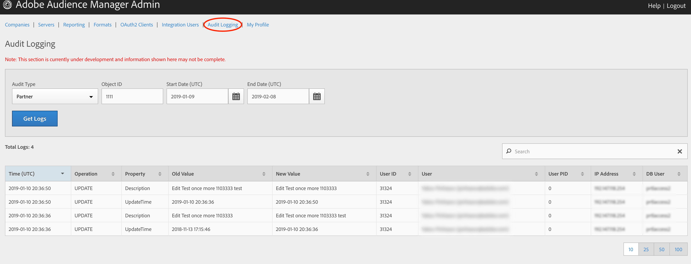

# Consignation d'audit {#audit-logging}

Utilisez comme [!UICONTROL  Audit Logging] premier emplacement pour déboguer les problèmes des utilisateurs.

> [!NOTE]
>
>[!UICONTROL Audit Logging] est actuellement en cours de développement et soumise à modification. Veuillez enregistrer les problèmes que vous rencontrez [!DNL JIRA] ([!DNL UI] équipe)

Dans **le sélecteur** déroulant Type d'audit, choisissez entre :

* [!UICONTROL Partner]
* [!UICONTROL User]
* [!UICONTROL Group]
* [!UICONTROL Datasource Summary]
* [!UICONTROL General Datasource]
* [!UICONTROL Merge Rule Datasource]
* [!UICONTROL Data Feed]
* [!UICONTROL Data Feed Subscription]
* [!UICONTROL Trait Summary]
* [!UICONTROL Trait Rule]
* [!UICONTROL Segment Summary]
* [!UICONTROL Destination Summary]
* [!UICONTROL Server to Server Destination]
* [!UICONTROL Derived Signal]
* [!UICONTROL Model]
* [!UICONTROL Segment Test Group]

L'ID **d'objet** est l'identifiant de l'article que vous recherchez. Voir le tableau ci-dessous pour lequel l'ID correspond à l'ID d'objet dans chaque cas :

| Type d'audit | Identifiant d’objet |
---------|----------|
| [!UICONTROL Partner] | ID de partenaire - PID |
| [!UICONTROL User] | Identifiant utilisateur |
| [!UICONTROL Group] | B3 |
| [!UICONTROL Datasource Summary] | Identifiant de source de données |
| [!UICONTROL General Datasource] | Identifiant de source de données |
| [!UICONTROL Merge Rule Datasource] | Identifiant de source de données |
| [!UICONTROL Data Feed] | Identifiant de flux de données |
| [!UICONTROL Data Feed Subscription] | Identifiant de flux de données |
| [!UICONTROL Trait Summary] | SID (caractéristique) |
| [!UICONTROL Trait Rule] | SID (caractéristique) |
| [!UICONTROL Segment Summary] |  |
| [!UICONTROL Destination Summary] |  |
| [!UICONTROL Server-to-Server Destination] | N/D |
| [!UICONTROL Derived Signal] | N/D |
| [!UICONTROL Model] | N/D |
| [!UICONTROL Segment Test Group] | N/D |

Use [!UICONTROL Start Date] ([!DNL UTC]) and [!UICONTROL End Date] ([!DNL UTC]) pour réduire l'intervalle des journaux.