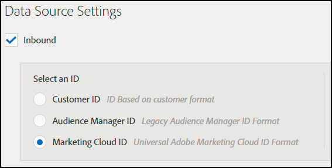

# Résolution des problèmes de configuration de destination {#destination-setup-troubleshooting}

Informations relatives à la configuration des destinations dans Audience Manager et à l’élimination des problèmes courants.

## J'ai monté une destination, mais je ne vois aucun fichier. Où sont-ils ? {#destination-no-files}

<!-- c_dest_tshooting.xml -->

Les problèmes courants de configuration de destination sont les suivants :

### Destination mal configurée

* **[!UICONTROL UserID]Clé** incorrecte : La [!UICONTROL UserID] clé est la [!UICONTROL MasterDPID] clé de cette destination et est la base des valeurs d’ID qui seront délimitées. Même si une [!UICONTROL UserID] clé est sélectionnable dans la liste déroulante, cela ne signifie pas nécessairement qu’il existe des ID/caractéristiques/segments associés à cette valeur. Si le [!UICONTROL Outbound] processus (qui s’exécute après la création des destinations) ne trouve aucun utilisateur associé à cette [!UICONTROL UserID] clé, aucune donnée n’est délimitée.
* **** Non Dans Les Sources De Données Du Fichier Sélectionnées : Lors du choix d’un type de destination autre que [!UICONTROL S2S], une section s’affiche au bas de l’écran, intitulée [!UICONTROL Configure Data Sources]. Lorsque cette section apparaît pour la première fois, aucune valeur n’est sélectionnée. Si vous oubliez de cocher la [!UICONTROL All First Party] case ou de sélectionner individuellement des sources de données dans la [!UICONTROL Available Data Sources] fenêtre, aucune donnée ne sera délimitée.

### Format mal configuré

Lorsque vous sélectionnez un format pour vos données délimitées, il est préférable, si possible, de réutiliser un format existant. L’utilisation d’un format déjà éprouvé garantit que vos données sortantes seront générées avec succès. Pour savoir exactement comment un format existant est formaté, cliquez sur l’ [!UICONTROL Formats] option dans la barre de menus et recherchez votre format par nom ou par numéro d’ID. Les formats ou macros mal formés utilisés dans les formats fournissent une sortie mal formatée ou empêchent la sortie complète des informations.

Pour plus d’informations sur la configuration des formats et l’utilisation des macros, voir Macros [au format](formats/file-formats.md#) de fichier et Macros au format [HTTP](formats/web-formats.md).

### Serveur mal configuré

* **[!DNL FTP]**
   * **[!UICONTROL Domain]**
      * N’entrez aucun préfixe pour les noms d’hôtes. Si vous avez un compte [!DNL ftp://hello.com], entrez [!DNL hello.com] dans ce champ.
   * **[!UICONTROL Port/Type Combination]**
      * Pour un [!DNL FTP] transfert, le type de transfert préféré est [!DNL SFTP].
      * Lors de la sélection du [!DNL SFTP] type, le port est presque toujours 22.
      * Lors de la sélection du [!DNL FTPs/TLS] type, le port est presque toujours de 21.
      * Le [!DNL FTPs/TLS] type n’est pas le même qu’un [!DNL FTP] transfert régulier. Nous ne soutenons pas les [!DNL FTP] transferts réguliers (non sécurisés).
   * **[!UICONTROL Remote Path]**
      * Lorsque vous choisissez un sous-chemin distant, il doit être saisi sans barre oblique.
      * Si votre fichier transféré est censé être placé dans le [!DNL (root)/inbound] sous-dossier, ajoutez simplement [!DNL inbound] pour le chemin d’accès distant, pas [!DNL /inbound].
      * Si vous envoyez vos fichiers à plusieurs répertoires par le chemin d’accès, entrez des barres obliques entre chaque répertoire. Si vous avez l'emplacement de [!DNL /inbound/subdirectory1/subdirectory2], vous devez entrer [!DNL inbound/subdirectory1/subdirectory2] dans ce champ.
      * Si votre fichier doit être placé dans le répertoire auquel le serveur externe renvoie automatiquement, vous pouvez laisser cet espace vide. N’entrez pas de point ( . ), slash ( / ) ou autre chose.

* **[!DNL S3]**
   * [!DNL S3] est le protocole de transfert préféré (au-dessus [!DNL FTP] ou [!DNL HTTP]).
      * **[!UICONTROL Bucket]**
         * Le nom du compartiment doit être répertorié sans barre oblique, préfixe, suffixe, etc. Si l'adresse [!DNL s3://your-bucket] vous est donnée, vous devez simplement ajouter [!DNL your-bucket] à ce champ.
      * **[!UICONTROL Directory]**
         * Ne renseignez pas ce champ, sauf si un sous-répertoire spécifique doit vous être attribué pour que les données soient placées. Si vous avez reçu l'adresse [!DNL s3://your-bucket/your-subdirectory], entrez [!DNL your-bucket] dans le [!UICONTROL Bucket] champ et [!DNL your-subdirectory] vous devez l'ajouter au [!UICONTROL Directory] champ. N’ajoutez pas de barres obliques précédentes.
         * Si vous devez parcourir plusieurs répertoires dans le chemin, vous devez alors utiliser des barres obliques comme séparateurs. Ainsi, un emplacement de [!DNL s3://your-bucket/your-subdirectory1/your-subdirectory2] aurait [!DNL your-bucket] dans le [!UICONTROL Bucket] champ et [!DNL your-subdirectory1/your-subdirectory2] aurait été entré dans le [!UICONTROL Directory] champ.
      * **[!UICONTROL Access / Secret Keys]**
         * Lorsque [!DNL TechOps] crée un compartiment et fournit des clés d’accès/de secret à un consultant, ces informations d’identification sont généralement `READ-ONLY` destinées à être transmises au client. Ces informations d’identification ne doivent pas être saisies dans les [!UICONTROL Access / Secret Key] champs, car le transfert échouera (car ces informations d’identification sont en lecture seule et ne sont pas modifiables). Dans le cas où [!DNL TechOps] crée un compartiment et fournit des informations d’identification, le consultant doit également demander une paire de clés Adobe - À NE PAS DONNER AU CLIENT - qui permettra d’écrire des fichiers dans ce compartiment. Cette clé doit être ajoutée à ces champs.

* **[!DNL HTTP]**
   * **[!UICONTROL Domain]**
      * Entrez des informations de préfixe pour [!DNL HTTP] les entrées. Si vous avez un compte [!DNL https://superduper.com], entrez [!DNL https://superduper.com] dans ce champ.
      * **[!UICONTROL URL Prefix]**
         * Lorsque vous ajoutez un [!DNL URL] préfixe, laissez la barre oblique précédente désactivée. Une adresse de [!DNL https://hello.com/r/x/y/z] doit [!DNL https://hello.com] être saisie dans le [!UICONTROL Domain] champ et [!DNL r/x/y/z] ici dans le [!UICONTROL URL Prefix] champ.
         * Si aucune valeur n’ [!UICONTROL URL Prefix] est nécessaire, laissez cette valeur vide.
      * **[!UICONTROL Authentication - SSH Key]**
         * Entrez la valeur de `SSH PRIVATE` clé complète dans cette zone, y compris les en-têtes, les pieds de page et les sauts de ligne, afin d’assurer un chiffrement/un stockage de clés précis.

### Pas assez de temps pour une génération sortante

Le processus de sélection s’exécute deux fois par jour et plusieurs processus (délimité, publication, publication vers des emplacements externes, etc.). doit s’exécuter avant qu’un fichier ne soit envoyé vers sa destination finale. Une bonne règle de base est qu’une destination doit être entièrement configurée au moins 24 heures avant que les données ne soient transférées vers un emplacement externe.

### Taille de fractionnement de fichier trop grande

Lorsque vous délimitez des fichiers vers des destinations, vous pouvez scinder des fichiers sortants plus volumineux en blocs de fichiers. Assurez-vous que les blocs de fichiers individuels ne dépassent pas 10 Go. Voir aussi Nom du fichier de données [sortantes : Syntaxe et exemples](https://docs.adobe.com/help/en/audience-manager/user-guide/implemenation-integration-guides/receiving-audience-data/batch-outbound-data-transfers/outbound-file-name-contents.html).

## Configuration de vos destinations pour exporter des ID de cloud d’expérience, des ID de client ou des ID d’Audience Manager dans des fichiers de données sortants {#set-up-destinations-export}

Cette page vous montre comment configurer des destinations pour exporter des données en dehors du type d’ID souhaité [!UICONTROL Outbound Data Files].

<!-- set-up-destinations-mcid-aamid.xml -->

Les destinations permettent à nos clients d’activer leurs données sur un nombre indéfini de canaux numériques. Par exemple, ils peuvent exporter des données d’audience vers d’autres [!DNL Adobe Experience Cloud] solutions ([!DNL Target], [!DNL Campaign], etc.). Ou bien, ils peuvent envoyer des données à [!UICONTROL DSP]des, [!UICONTROL SSP]des applications ou à n’importe quelle plate-forme intégrée à Audience Manager. Nous conservons une liste de partenaires avec lesquels nous travaillons sur notre page [Wiki](https://wiki.corp.adobe.com/display/MCPI)Intégrations.

>[!NOTE]
>
>Pour une présentation détaillée de la création de destinations dans l’interface utilisateur d’administration, consultez l’article [Créer ou modifier des destinations](companies/admin-manage-company-destinations.md#create-edit-company-destinations) d’entreprise.

Vos clients souhaitent exporter différents types d’ID, selon la destination. Le graphique de configuration ci-dessous présente les options que vous devez sélectionner pour exporter les informations de profil liées aux différents types d’ID. Nous vous recommandons également de consulter l’ [index des identifiants dans Audience Manager](https://marketing.adobe.com/resources/help/en_US/aam/ids-in-aam.html). Il y a trois paramètres importants à prendre en compte : le [!UICONTROL User ID Key], le [!UICONTROL Data Source Type] et le [!UICONTROL Format]. Nous les détaillons tous ci-dessous.

* [!UICONTROL User ID Key]. Dans le [!UICONTROL Admin UI], allez **[!UICONTROL Companies]**. Recherchez la société de votre client et cliquez dessus. Recherchez l’ **[!UICONTROL Destinations]** onglet et appuyez sur **[!UICONTROL Add Destination]**. Dans le **[!UICONTROL Add Destination]** processus, sélectionnez le [!UICONTROL User ID Key]. Le [!UICONTROL User ID Key] filtre les identifiants entrants à partir de la source de données cible et autorise uniquement la transmission des identifiants.

   

* [!UICONTROL Data Source Type]. Sélectionnez cette option lors de la création d’une destination dans l’interface utilisateur d’Audience Manager. Tout d’abord, sélectionnez [!UICONTROL Inbound], puis sélectionnez le type d’ID souhaité. Les options sont les suivantes :

   

* [!UICONTROL Format]. Cette option détermine le format de fichier que vous allez exporter. Dans le **[!UICONTROL Add Destination]** processus, sous **[!UICONTROL Batch Data]**, sélectionnez le format.

Pour inspecter un format, accédez à **[!UICONTROL Admin UI > Formats]** et recherchez l’ [!UICONTROL Data Row] élément. Cet élément contient une macro du format de fichier, &lt;MCID&gt; dans l’exemple ci-dessous.

<table id="table_DAEE5BC75DCB4FC690C4BAE41F627DEC"> 
 <thead> 
  <tr> 
   <th colname="col01" class="entry"> N° de configuration </th> 
   <th colname="col1" class="entry"> 
Clé utilisateur 
 </th> 
   <th colname="col2" class="entry"> 
Type de source de données 
 </th> 
   <th colname="col3" class="entry"> 
Format 
 </th> 
   <th colname="col4" class="entry"> 
Type d’ID exporté 
 </th> 
  </tr>
 </thead>
 <tbody> 
  <tr> 
   <td colname="col01"> 1 </td> 
   <td colname="col1"> 
Adobe Audience Manager (0) 
 </td> 
   <td colname="col2"> 
Experience Cloud ID 
 </td> 
   <td colname="col3"> 
&lt;DP_UUID&gt; 
 </td> 
   <td colname="col4"> 
Experience Cloud ID 
 </td> 
  </tr> 
  <tr> 
   <td colname="col01"> 2 </td> 
   <td colname="col1"> 
Adobe Audience Manager (0) 
 </td> 
   <td colname="col2"> 
Experience Cloud ID 
 </td> 
   <td colname="col3"> 
MCID 
 </td> 
   <td colname="col4"> 
UUID Audience Manager 
 </td> 
  </tr> 
  <tr> 
   <td colname="col01"> 3 </td> 
   <td colname="col1"> 
Adobe Audience Manager (0) 
 </td> 
   <td colname="col2"> 
Experience Cloud ID 
 </td> 
   <td colname="col3"> 
UUID 
 </td> 
   <td colname="col4"> 
Experience Cloud ID 
 </td> 
  </tr> 
  <tr> 
   <td colname="col01"> 4 </td> 
   <td colname="col1"> 
Adobe Audience Manager (0) 
 </td> 
   <td colname="col2"> 
Identifiant Audience Manager 
 </td> 
   <td colname="col3"> 
&lt;DP_UUID&gt; 
 </td> 
   <td colname="col4"> 
UUID Audience Manager 
 </td> 
  </tr> 
  <tr> 
   <td colname="col01"> 5 </td> 
   <td colname="col1"> 
Adobe Audience Manager (0) 
 </td> 
   <td colname="col2"> 
Identifiant Audience Manager 
 </td> 
   <td colname="col3"> 
MCID 
 </td> 
   <td colname="col4"> 
Experience Cloud ID 
 </td> 
  </tr> 
  <tr> 
   <td colname="col01"> 6 </td> 
   <td colname="col1"> 
Adobe Audience Manager (0) 
 </td> 
   <td colname="col2"> 
Identifiant Audience Manager 
 </td> 
   <td colname="col3"> 
UUID 
 </td> 
   <td colname="col4"> 
UUID Audience Manager 
 </td> 
  </tr> 
  <tr> 
   <td colname="col01"> 7 </td> 
   <td colname="col1"> 
DPID (toute source de données à laquelle l’entreprise a accès) 
 </td> 
   <td colname="col2"> 
Customer ID 
 </td> 
   <td colname="col3"> 
&lt;DP_UUID&gt; 
 </td> 
   <td colname="col4"> 
ID de client (DPUUID) 
 </td> 
  </tr> 
  <tr> 
   <td colname="col01"> 8 </td> 
   <td colname="col1"> 
DPID (toute source de données à laquelle l’entreprise a accès) 
 </td> 
   <td colname="col2"> 
Customer ID 
 </td> 
   <td colname="col3"> 
MCID 
 </td> 
   <td colname="col4"> 
Experience Cloud ID 
 </td> 
  </tr> 
  <tr> 
   <td colname="col01"> 9 </td> 
   <td colname="col1"> 
DPID (toute source de données à laquelle l’entreprise a accès) 
 </td> 
   <td colname="col2"> 
Customer ID 
 </td> 
   <td colname="col3"> 
UUID 
 </td> 
   <td colname="col4"> 
UUID Audience Manager 
 </td> 
  </tr> 
  <tr> 
   <td colname="col01"> 10 </td> 
   <td colname="col1"> 
DPID (toute source de données à laquelle l’entreprise a accès) 
 </td> 
   <td colname="col2"> 
Identifiant Audience Manager 
 </td> 
   <td colname="col3"> 
&lt;DP_UUID&gt; 
 </td> 
   <td colname="col4"> 
UUID Audience Manager 
 </td> 
  </tr> 
  <tr> 
   <td colname="col01"> 11 </td> 
   <td colname="col1"> 
DPID (toute source de données à laquelle l’entreprise a accès) 
 </td> 
   <td colname="col2"> 
Identifiant Audience Manager 
 </td> 
   <td colname="col3"> 
MCID 
 </td> 
   <td colname="col4"> 
Experience Cloud ID 
 </td> 
  </tr> 
  <tr> 
   <td colname="col01"> 12 </td> 
   <td colname="col1"> 
DPID (toute source de données à laquelle l’entreprise a accès) 
 </td> 
   <td colname="col2"> 
Identifiant Audience Manager 
 </td> 
   <td colname="col3"> 
UUID 
 </td> 
   <td colname="col4"> 
UUID Audience Manager 
 </td> 
  </tr> 
 </tbody> 
</table>

## Cas d’utilisation

Disons que vous utilisez Audience Manager et [!DNL Campaign]. Pour rendre les données client exploitables dans [!DNL Campaign], vous souhaitez exporter [!UICONTROL Experience Cloud IDs]. Dans ce cas, vous devez utiliser la configuration numéro 3.