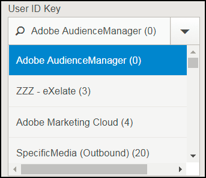
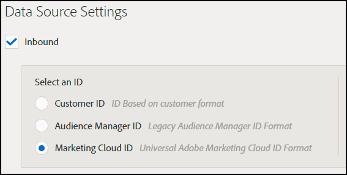
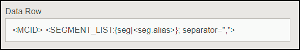

# Dépannage de la configuration de la destination {#destination-setup-troubleshooting}

Ces informations vous aident à configurer des destinations en Audience Manager et à éviter les problèmes courants.

## J&#39;ai configuré une destination, mais je ne vois aucun fichier. Où sont-ils ? {#destination-no-files}

<!-- c_dest_tshooting.xml -->

Les problèmes courants de configuration des destinations incluent les problèmes suivants :

### Destination mal configurée

* **Clé [!UICONTROL UserID] incorrecte :** La clé [!UICONTROL UserID] est le [!UICONTROL MasterDPID] de cette destination et est la base des valeurs d’ID qui seront délimitées. Même si une clé [!UICONTROL UserID] peut être sélectionnée par le biais de la liste déroulante, cela ne signifie pas nécessairement qu’il existe des identifiants/caractéristiques/segments mappés à cette valeur. Si le processus [!UICONTROL Outbound] (qui s’exécute après la création des destinations) ne trouve aucun utilisateur mappé à cette clé [!UICONTROL UserID], aucune donnée ne sera délimitée.
* **Non sélectionné dans les sources de données de fichier :** Lors du choix d’un type de destination autre que [!UICONTROL S2S], une section s’affiche au bas de l’écran intitulée [!UICONTROL Configure Data Sources]. Lorsque cette section apparaît pour la première fois, aucune valeur n’est sélectionnée. Si vous oubliez de cocher la case [!UICONTROL All First Party] ou de sélectionner individuellement des sources de données dans la fenêtre [!UICONTROL Available Data Sources], aucune donnée ne sera délimitée.

### Format mal configuré

Lors de la sélection d’un format pour vos données délimitées, il est préférable, si possible, de réutiliser un format existant. L’utilisation d’un format déjà éprouvé garantit que vos données sortantes seront générées avec succès. Pour voir exactement comment un format existant est formaté, cliquez sur l’option [!UICONTROL Formats] de la barre de menus et recherchez votre format par nom ou par numéro d’ID. Les formats incorrects ou les macros utilisés dans les formats fournissent une sortie mal formatée ou empêchent la sortie complète des informations.

Pour plus d’informations sur la configuration des formats et l’utilisation des macros, voir [Macros au format de fichier](formats/file-formats.md#) et [Macros au format HTTP](formats/web-formats.md).

### Serveur mal configuré

* **[!DNL FTP]**
   * **[!UICONTROL Domain]**
      * Ne saisissez aucun préfixe pour les noms d’hôtes. Si un compte [!DNL ftp://hello.com] vous est attribué, entrez simplement [!DNL hello.com] dans ce champ.
   * **[!UICONTROL Port/Type Combination]**
      * Pour un transfert [!DNL FTP], le type de transfert préféré est [!DNL SFTP].
      * Lors de la sélection du type [!DNL SFTP], le port est presque toujours 22.
      * Lors de la sélection du type [!DNL FTPs/TLS], le port est presque toujours 21.
      * Le type [!DNL FTPs/TLS] n’est pas le même qu’un transfert [!DNL FTP] normal. Nous ne prenons pas en charge les transferts [!DNL FTP] standard (non sécurisés).
   * **[!UICONTROL Remote Path]**
      * Lors du choix d’un sous-chemin distant, il doit être saisi sans barre oblique.
      * Si votre fichier transféré est censé être placé dans le sous-dossier [!DNL (root)/inbound], ajoutez simplement [!DNL inbound] pour le chemin d’accès distant, et non [!DNL /inbound].
      * Si vous envoyez vos fichiers plusieurs répertoires par le chemin d’accès, saisissez des barres obliques entre chaque répertoire. Si l’emplacement de [!DNL /inbound/subdirectory1/subdirectory2] vous est attribué, vous devez saisir [!DNL inbound/subdirectory1/subdirectory2] dans ce champ.
      * Si votre fichier doit être placé dans le répertoire auquel le serveur externe route automatiquement, vous pouvez laisser cet espace vide. Ne saisissez pas de point ( . ), barre oblique ( / ) ou tout autre élément.

* **[!DNL S3]**
   * [!DNL S3] est le protocole de transfert préféré (plus que [!DNL FTP] ou [!DNL HTTP]).
      * **[!UICONTROL Bucket]**
         * Le nom du compartiment doit être répertorié sans barres obliques, préfixes, suffixes, etc. Si l&#39;adresse [!DNL s3://your-bucket] vous est attribuée, il vous suffit d&#39;ajouter [!DNL your-bucket] à ce champ.
      * **[!UICONTROL Directory]**
         * Laissez ce champ vide, sauf si un sous-répertoire spécifique doit vous être attribué pour les données. Si vous recevez l’adresse [!DNL s3://your-bucket/your-subdirectory], saisissez [!DNL your-bucket] dans le champ [!UICONTROL Bucket] et [!DNL your-subdirectory] doit être ajouté dans le champ [!UICONTROL Directory]. N’ajoutez pas de barres obliques précédentes.
         * Si vous devez parcourir plusieurs répertoires par le chemin, vous devez uniquement utiliser des barres obliques comme séparateurs. Par conséquent, un emplacement de [!DNL s3://your-bucket/your-subdirectory1/your-subdirectory2] aurait [!DNL your-bucket] dans le champ [!UICONTROL Bucket] et [!DNL your-subdirectory1/your-subdirectory2] dans le champ [!UICONTROL Directory].
      * **[!UICONTROL Access / Secret Keys]**
         * Lorsque [!DNL TechOps] crée un compartiment et fournit des clés d’accès/de secret à un consultant, ces informations d’identification sont généralement `READ-ONLY` et sont destinées à être transmises au client. Ces informations d’identification ne doivent pas être saisies dans les champs [!UICONTROL Access / Secret Key], car le transfert échoue (car ces informations d’identification sont en lecture seule et ne peuvent pas être écrites). Dans le cas où [!DNL TechOps] crée un compartiment et fournit des informations d’identification, le consultant doit également demander une paire de clés d’Adobe - À NE PAS DONNER AU CLIENT - qui permettra d’écrire des fichiers dans ce compartiment. Cette clé doit être ajoutée dans ces champs.

* **[!DNL HTTP]**
   * **[!UICONTROL Domain]**
      * Saisissez des informations de préfixe pour les entrées [!DNL HTTP]. Si un compte [!DNL https://superduper.com] vous est attribué, saisissez [!DNL https://superduper.com] dans ce champ.
      * **[!UICONTROL URL Prefix]**
         * Lors de l’ajout d’un préfixe [!DNL URL], laissez la barre oblique précédente désactivée. [!DNL https://hello.com] doit avoir été saisi dans le champ [!UICONTROL Domain] d’une adresse [!DNL https://hello.com/r/x/y/z] et [!DNL r/x/y/z] dans le champ [!UICONTROL URL Prefix].
         * Si un [!UICONTROL URL Prefix] n’est pas nécessaire, laissez cette valeur vide.
      * **[!UICONTROL Authentication - SSH Key]**
         * Saisissez la valeur de clé `SSH PRIVATE` complète dans cette zone, y compris les en-têtes, les pieds de page et les sauts de ligne pour garantir un chiffrement/un stockage de clé précis.

### Pas assez de temps pour la génération sortante

Le processus de décodage s’exécute deux fois par jour et plusieurs processus (décodage, publication, publication vers des emplacements externes, etc.) doit s’exécuter avant qu’un fichier ne soit envoyé vers sa destination finale. Une bonne règle de base est qu’une destination doit être entièrement configurée au moins 24 heures avant que vous puissiez vous attendre à ce que les données soient transmises à un emplacement externe.

### Taille trop importante de la division de fichiers

Lors de l’exploration de fichiers vers des destinations, vous pouvez fractionner des fichiers sortants plus volumineux en blocs de fichiers. Assurez-vous que les blocs de fichiers individuels ne dépassent pas 10 Go. Voir aussi [Nom de fichier de données sortantes : syntaxe et exemples](https://experienceleague.adobe.com/docs/audience-manager/user-guide/implementation-integration-guides/receiving-audience-data/batch-outbound-data-transfers/outbound-file-name-contents.html?lang=en).

## Comment configurer vos destinations pour exporter des ID Experience Cloud, des ID de client ou des ID d’Audience Manager dans des fichiers de données sortants {#set-up-destinations-export}

Cette page vous explique comment configurer des destinations pour exporter des données en dehors du type d’ID souhaité dans [!UICONTROL Outbound Data Files].

<!-- set-up-destinations-mcid-aamid.xml -->

Les destinations permettent à nos clients d’activer leurs données sur n’importe quel nombre de canaux numériques. Par exemple, ils peuvent exporter les données d’audience vers d’autres solutions [!DNL Adobe Experience Cloud] ([!DNL Target], [!DNL Campaign], etc.). Ou bien, ils peuvent envoyer des données à [!UICONTROL DSP]s, [!UICONTROL SSP]s, ou toute plateforme intégrée à Audience Manager. Nous conservons une liste des partenaires avec lesquels nous travaillons sur notre [page Wiki Intégrations](https://wiki.corp.adobe.com/display/MCPI).

>[!NOTE]
>
>Pour une présentation détaillée sur la création de destinations dans l’interface utilisateur d’administration, consultez l’article [Créer ou modifier des destinations d’entreprise](companies/admin-manage-company-destinations.md#create-edit-company-destinations) .

Vos clients souhaitent exporter différents types d’ID en fonction de la destination. Le graphique de configuration ci-dessous montre les options que vous devez sélectionner pour exporter les informations de profil liées à différents types d’ID. Nous vous recommandons également de vous référer à l&#39;[Index des identifiants en Audience Manager](https://experienceleague.adobe.com/docs/audience-manager/user-guide/reference/ids-in-aam.html?lang=en). Il y a trois paramètres importants à prendre en compte : [!UICONTROL User ID Key], [!UICONTROL Data Source Type] et [!UICONTROL Format]. Nous les détaillons tous ci-dessous.

* [!UICONTROL User ID Key]. Dans le [!UICONTROL Admin UI], accédez à **[!UICONTROL Companies]**. Recherchez la société de votre client et cliquez dessus. Recherchez l’onglet **[!UICONTROL Destinations]** et appuyez sur **[!UICONTROL Add Destination]**. Dans le workflow **[!UICONTROL Add Destination]**, sélectionnez le [!UICONTROL User ID Key]. [!UICONTROL User ID Key] filtrera les identifiants entrants de la source de données cible et ne permettra de transmettre que les identifiants.

  

* [!UICONTROL Data Source Type]. Sélectionnez cette option lors de la création d’une destination dans l’interface utilisateur d’Audience Manager. Tout d&#39;abord, sélectionnez [!UICONTROL Inbound], puis sélectionnez le type d&#39;ID souhaité. Les options sont les suivantes :

  

* [!UICONTROL Format]. Cette option détermine le format de fichier à exporter. Dans le workflow **[!UICONTROL Add Destination]**, sous **[!UICONTROL Batch Data]**, sélectionnez le format.

Pour examiner un format, accédez à **[!UICONTROL Admin UI > Formats]** et recherchez l’élément [!UICONTROL Data Row] . Cet élément contient une macro du format de fichier, &lt;MCID> dans l’exemple ci-dessous.

<table id="table_DAEE5BC75DCB4FC690C4BAE41F627DEC"> 
 <thead> 
  <tr> 
   <th colname="col01" class="entry"> Numéro de configuration </th> 
   <th colname="col1" class="entry"> 
Clé utilisateur 
 </th> 
   <th colname="col2" class="entry"> 
Type de Source de données 
 </th> 
   <th colname="col3" class="entry"> 
Format 
 </th> 
   <th colname="col4" class="entry"> 
Type d’ID exporté 
 </th> 
  </tr>
 </thead>
 <tbody> 
  <tr> 
   <td colname="col01"> 1 </td> 
   <td colname="col1"> 
Adobe Audience Manager (0) 
 </td> 
   <td colname="col2"> 
Experience Cloud ID 
 </td> 
   <td colname="col3"> 
&lt;DP_UUID&gt; 
 </td> 
   <td colname="col4"> 
Experience Cloud ID 
 </td> 
  </tr> 
  <tr> 
   <td colname="col01"> 2 </td> 
   <td colname="col1"> 
Adobe Audience Manager (0) 
 </td> 
   <td colname="col2"> 
Experience Cloud ID 
 </td> 
   <td colname="col3"> 
MCID 
 </td> 
   <td colname="col4"> 
UUID Audience Manager 
 </td> 
  </tr> 
  <tr> 
   <td colname="col01"> 3 </td> 
   <td colname="col1"> 
Adobe Audience Manager (0) 
 </td> 
   <td colname="col2"> 
Experience Cloud ID 
 </td> 
   <td colname="col3"> 
UUID 
 </td> 
   <td colname="col4"> 
Experience Cloud ID 
 </td> 
  </tr> 
  <tr> 
   <td colname="col01"> 4 </td> 
   <td colname="col1"> 
Adobe Audience Manager (0) 
 </td> 
   <td colname="col2"> 
ID d’Audience Manager 
 </td> 
   <td colname="col3"> 
&lt;DP_UUID&gt; 
 </td> 
   <td colname="col4"> 
UUID Audience Manager 
 </td> 
  </tr> 
  <tr> 
   <td colname="col01"> 5 </td> 
   <td colname="col1"> 
Adobe Audience Manager (0) 
 </td> 
   <td colname="col2"> 
ID d’Audience Manager 
 </td> 
   <td colname="col3"> 
MCID 
 </td> 
   <td colname="col4"> 
Experience Cloud ID 
 </td> 
  </tr> 
  <tr> 
   <td colname="col01"> 6 </td> 
   <td colname="col1"> 
Adobe Audience Manager (0) 
 </td> 
   <td colname="col2"> 
ID d’Audience Manager 
 </td> 
   <td colname="col3"> 
UUID 
 </td> 
   <td colname="col4"> 
UUID Audience Manager 
 </td> 
  </tr> 
  <tr> 
   <td colname="col01"> 7 </td> 
   <td colname="col1"> 
DPID (toute source de données à laquelle l’entreprise a accès) 
 </td> 
   <td colname="col2"> 
Identifiant client 
 </td> 
   <td colname="col3"> 
&lt;DP_UUID&gt; 
 </td> 
   <td colname="col4"> 
ID de client (DPUUID) 
 </td> 
  </tr> 
  <tr> 
   <td colname="col01"> 8 </td> 
   <td colname="col1"> 
DPID (toute source de données à laquelle l’entreprise a accès) 
 </td> 
   <td colname="col2"> 
Identifiant client 
 </td> 
   <td colname="col3"> 
MCID 
 </td> 
   <td colname="col4"> 
Experience Cloud ID 
 </td> 
  </tr> 
  <tr> 
   <td colname="col01"> 9 </td> 
   <td colname="col1"> 
DPID (toute source de données à laquelle l’entreprise a accès) 
 </td> 
   <td colname="col2"> 
Identifiant client 
 </td> 
   <td colname="col3"> 
UUID 
 </td> 
   <td colname="col4"> 
UUID Audience Manager 
 </td> 
  </tr> 
  <tr> 
   <td colname="col01"> 10 </td> 
   <td colname="col1"> 
DPID (toute source de données à laquelle l’entreprise a accès) 
 </td> 
   <td colname="col2"> 
ID d’Audience Manager 
 </td> 
   <td colname="col3"> 
&lt;DP_UUID&gt; 
 </td> 
   <td colname="col4"> 
UUID Audience Manager 
 </td> 
  </tr> 
  <tr> 
   <td colname="col01"> 11 </td> 
   <td colname="col1"> 
DPID (toute source de données à laquelle l’entreprise a accès) 
 </td> 
   <td colname="col2"> 
ID d’Audience Manager 
 </td> 
   <td colname="col3"> 
MCID 
 </td> 
   <td colname="col4"> 
Experience Cloud ID 
 </td> 
  </tr> 
  <tr> 
   <td colname="col01"> 12 </td> 
   <td colname="col1"> 
DPID (toute source de données à laquelle l’entreprise a accès) 
 </td> 
   <td colname="col2"> 
ID d’Audience Manager 
 </td> 
   <td colname="col3"> 
UUID 
 </td> 
   <td colname="col4"> 
UUID Audience Manager 
 </td> 
  </tr> 
 </tbody> 
</table>

## Cas d’utilisation

Supposons que vous utilisiez l’Audience Manager et [!DNL Campaign]. Pour que les données client soient exploitables dans [!DNL Campaign], vous souhaitez exporter [!UICONTROL Experience Cloud IDs]. Dans ce cas, vous devez utiliser le numéro de configuration 3.
