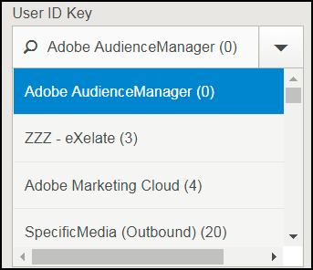
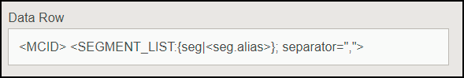

# Résolution des problèmes de configuration de la destination {#destination-setup-troubleshooting}

Informations destinées à vous aider à configurer les destinations dans Audience Manager et à éviter les problèmes courants.

## Je configure une destination, mais je ne vois aucun fichier. Où sont-ils ? {#destination-no-files}

<!-- c_dest_tshooting.xml -->

Les problèmes courants de configuration de destination sont les suivants :

### Destination mal configurée

* **Clé incorrecte[!UICONTROL UserID]:** [!UICONTROL UserID] La clé est la [!UICONTROL MasterDPID] base de cette destination et est la base des valeurs d'ID qui seront arrondies. Même si une [!UICONTROL UserID] clé est sélectionnée dans la liste déroulante, cela ne signifie pas nécessairement qu'il existe des ID/caractéristiques/segments associés à cette valeur. Si [!UICONTROL Outbound] le processus (qui s'exécute après la création des destinations) ne trouve aucun utilisateur associé à cette [!UICONTROL UserID] clé, aucune donnée n'est comptabilisée.
* **No In File Data Sources Selected :** Lorsque vous choisissez un type de destination autre [!UICONTROL S2S]que, une section s'affiche au bas de l'écran. [!UICONTROL Configure Data Sources] Lorsque cette section apparaît pour la première fois, aucune valeur n'est sélectionnée. Si vous oubliez de cocher la [!UICONTROL All First Party] case ou de sélectionner individuellement les sources de données à partir [!UICONTROL Available Data Sources] de la fenêtre, aucune donnée n'est finalisée.

### Format mal configuré

Lorsque vous sélectionnez un format pour vos données arrondies, il est préférable, si possible, de réutiliser un format existant. L'utilisation d'un format déjà prouvé garantit la génération réussie de vos données sortantes. Pour afficher exactement le format d'un format existant, cliquez sur l' [!UICONTROL Formats] option dans la barre de menus et recherchez votre format par nom ou par numéro d'identifiant. Les formats ou macros mal formés utilisés dans les formats fournissent une sortie mal formatée ou empêchent la sortie complète des informations.

Pour plus d'informations sur le paramétrage des formats et des macros, voir [Formats de fichier Macros](formats/file-formats.md#) et [Macros de format HTTP](formats/web-formats.md).

### Serveur mal configuré

* **[!DNL FTP]**
   * **[!UICONTROL Domain]**
      * Ne saisissez aucun préfixe pour les noms d'hôte. Si un compte [!DNL ftp://hello.com]vous est attribué, saisissez simplement [!DNL hello.com] dans ce champ.
   * **[!UICONTROL Port/Type Combination]**
      * Pour [!DNL FTP] un transfert, le type de transfert préféré est [!DNL SFTP].
      * Lors de la sélection du [!DNL SFTP] type, le port est presque toujours 22.
      * Lors de la sélection du [!DNL FTPs/TLS] type, le port est presque toujours 21.
      * Le [!DNL FTPs/TLS] type est différent d'un transfert normal [!DNL FTP] . Nous ne prenons pas en charge [!DNL FTP] les transferts normaux (non sécurisés).
   * **[!UICONTROL Remote Path]**
      * Lorsque vous choisissez un sous-chemin distant, il doit être saisi sans barre oblique principale.
      * Si le fichier transféré est censé être placé dans le [!DNL (root)/inbound] sous-dossier, ajoutez simplement [!DNL inbound] pour le chemin distant, pas [!DNL /inbound].
      * Si vous envoyez vos fichiers à plusieurs répertoires vers le bas, saisissez des barres obliques dans - entre chaque répertoire. Si vous avez l'emplacement de [!DNL /inbound/subdirectory1/subdirectory2], vous devez saisir [!DNL inbound/subdirectory1/subdirectory2] dans ce champ.
      * Si votre fichier doit être placé dans le répertoire automatiquement acheminé vers le serveur externe, vous pouvez laisser cet espace vide. Ne saisissez pas de point (. ), barre oblique (/), ou tout autre élément.

* **[!DNL S3]**
   * [!DNL S3] est le protocole de transfert préféré (via [!DNL FTP] ou [!DNL HTTP]).
      * **[!UICONTROL Bucket]**
         * Le nom du compartiment doit être répertorié sans barres obliques, préfixes, suffixes, etc. Si l'adresse [!DNL s3://your-bucket] vous est affectée, vous devez simplement ajouter [!DNL your-bucket] à ce champ.
      * **[!UICONTROL Directory]**
         * Laissez ce champ vide, sauf si vous recevez un sous-répertoire spécifique dans lequel les données doivent être placées. Si l'adresse [!DNL s3://your-bucket/your-subdirectory]vous est affectée, entrez [!DNL your-bucket] dans [!UICONTROL Bucket] le champ et [!DNL your-subdirectory] doit être ajoutée dans [!UICONTROL Directory] le champ. N'ajoutez pas les barres obliques précédentes.
         * Si vous devez déplacer plusieurs annuaires vers le bas, vous devez alors utiliser des barres obliques comme séparateurs. Ainsi, un emplacement de [!DNL s3://your-bucket/your-subdirectory1/your-subdirectory2] l'emplacement [!DNL your-bucket] serait dans [!UICONTROL Bucket] le champ et [!DNL your-subdirectory1/your-subdirectory2] saisi dans [!UICONTROL Directory] le champ.
      * **[!UICONTROL Access / Secret Keys]**
         * Lors [!DNL TechOps] de la création d'un compartiment et fournit des clés d'accès/secret à un consultant, ces informations d'identification sont généralement `READ-ONLY` des informations d'identification qui sont censées être transmises au client. Ces informations d'identification ne doivent pas être entrées dans [!UICONTROL Access / Secret Key] les champs, car le transfert échoue (car ces informations d'identification sont en lecture seule et non en écriture). Dans le cas où [!DNL TechOps] vous créez un compartiment et fournissez des informations d'identification, le consultant doit également demander une paire de clés Adobe - NE PAS être DONNÉ AU CLIENT - qui autorise l'écriture de fichiers dans cet intervalle. Cette clé doit être ajoutée à ces champs.

* **[!DNL HTTP]**
   * **[!UICONTROL Domain]**
      * Saisissez des informations de préfixe pour [!DNL HTTP] les entrées. Si un compte [!DNL https://superduper.com]vous est attribué, entrez [!DNL https://superduper.com] dans ce champ.
      * **[!UICONTROL URL Prefix]**
         * Lorsque vous ajoutez un [!DNL URL] préfixe, désactivez la barre oblique précédente. Une adresse of [!DNL https://hello.com/r/x/y/z] should have [!DNL https://hello.com] should have entered in the [!UICONTROL Domain] field and [!DNL r/x/y/z] entered here in the [!UICONTROL URL Prefix] field.
         * Si une [!UICONTROL URL Prefix] valeur n'est pas nécessaire, laissez cette valeur vide.
      * **[!UICONTROL Authentication - SSH Key]**
         * Saisissez la valeur `SSH PRIVATE` de clé complète dans cette zone, y compris les en-têtes, les pieds de page et les sauts de ligne pour garantir un chiffrement/stockage clé précis.

### Délai insuffisant pour la génération sortante

Le processus de finition s'exécute deux fois par jour et plusieurs processus (finition, publication, publication vers des emplacements externes, etc.) doit s'exécuter avant qu'un fichier ne soit transmis à sa destination finale. Une bonne règle de pouce est qu'une destination doit être entièrement configurée au moins 24 heures avant que les données ne soient transférées vers un emplacement externe.

### Taille de fichier fractionnée trop grande

Lorsque vous définissez des fichiers de fin vers des destinations, vous pouvez fractionner des fichiers sortants plus volumineux dans des découpages de fichier. Assurez-vous que les découpes de fichier individuelles ne dépassent pas 10 Go. Voir aussi Fichier de données [sortantes - nom : Syntaxe et exemples](https://docs.adobe.com/help/en/audience-manager/user-guide/implemenation-integration-guides/receiving-audience-data/batch-outbound-data-transfers/outbound-file-name-contents.html).

## Comment configurer vos destinations pour exporter des ID d'expérience, des ID de client ou des identifiants Audience Manager dans des fichiers de données sortants ? {#set-up-destinations-export}

Cette page vous montre comment configurer les destinations pour exporter des données en fonction du type d'ID dans [!UICONTROL Outbound Data Files]lequel vous voulez.

<!-- set-up-destinations-mcid-aamid.xml -->

Les destinations permettent à nos clients d'activer leurs données sur n'importe quel nombre de canaux numériques. Par exemple, ils peuvent exporter les données d'audience vers d'autres [!DNL Adobe Experience Cloud] solutions ([!DNL Target][!DNL Campaign], etc.). Ils peuvent également envoyer des données à [!UICONTROL DSP]s, [!UICONTROL SSP]s ou toute plateforme intégrée à Audience Manager. Nous conservons la liste des partenaires avec lesquels nous travaillons sur notre page [Intégrations Wiki](https://wiki.corp.adobe.com/display/MCPI).

>[!NOTE]
>
>Pour savoir comment créer des destinations dans l'interface utilisateur d'administration, consultez l'article [Créer ou modifier des destinations](companies/admin-manage-company-destinations.md#create-edit-company-destinations) de société.

Vos clients souhaitent exporter différents types d'ID, selon la destination. Le diagramme de configuration ci-dessous illustre les options que vous devez sélectionner pour exporter les informations de profil liées à différents types d'ID. Nous vous recommandons également de faire référence à [l'index des ID dans Audience Manager](https://marketing.adobe.com/resources/help/en_US/aam/ids-in-aam.html). Il existe trois paramètres importants [!UICONTROL User ID Key]à prendre en compte [!UICONTROL Data Source Type][!UICONTROL Format]: Nous détaillons toutes les informations ci-dessous.

* [!UICONTROL User ID Key]. Dans la [!UICONTROL Admin UI], accédez **[!UICONTROL Companies]**&#x200B;à. Recherchez la société de votre client et cliquez dessus. Recherchez l **[!UICONTROL Destinations]** 'onglet et appuyez **[!UICONTROL Add Destination]** sur. Dans **[!UICONTROL Add Destination]** le flux de travail, sélectionnez le [!UICONTROL User ID Key]. Le [!UICONTROL User ID Key] filtrage des identifiants entrants provient de la source de données cible et autorise uniquement le transfert des ID.

   

* [!UICONTROL Data Source Type]. Sélectionnez cette option lors de la création d'une destination dans l'interface utilisateur d'Audience Manager. Sélectionnez tout d'abord, puis [!UICONTROL Inbound]sélectionnez le type d'ID voulu. Les options disponibles sont les suivantes :

   

* [!UICONTROL Format]. Cette option détermine le format de fichier que vous allez exporter. Dans **[!UICONTROL Add Destination]** le flux de travail, sous **[!UICONTROL Batch Data]**, sélectionnez le format.

Pour examiner un format, accédez **[!UICONTROL Admin UI > Formats]** à l [!UICONTROL Data Row] 'élément et recherchez-le. Cet élément contient une macro du format de fichier, &lt; MCID &gt;, dans l'exemple ci-dessous.

<table id="table_DAEE5BC75DCB4FC690C4BAE41F627DEC"> 
 <thead> 
  <tr> 
   <th colname="col01" class="entry"> Configuration Non. </th> 
   <th colname="col1" class="entry"> 
Clé utilisateur 
 </th> 
   <th colname="col2" class="entry"> 
Type de source de données 
 </th> 
   <th colname="col3" class="entry"> 
Format 
 </th> 
   <th colname="col4" class="entry"> 
Type d'ID exporté 
 </th> 
  </tr>
 </thead>
 <tbody> 
  <tr> 
   <td colname="col01"> 1 </td> 
   <td colname="col1"> 
Adobe Audience Manager (0) 
 </td> 
   <td colname="col2"> 
Experience Cloud ID 
 </td> 
   <td colname="col3"> 
&lt; DP_ UUID &gt; 
 </td> 
   <td colname="col4"> 
Experience Cloud ID 
 </td> 
  </tr> 
  <tr> 
   <td colname="col01"> 2 </td> 
   <td colname="col1"> 
Adobe Audience Manager (0) 
 </td> 
   <td colname="col2"> 
Experience Cloud ID 
 </td> 
   <td colname="col3"> 
MCID 
 </td> 
   <td colname="col4"> 
UUID Audience Manager 
 </td> 
  </tr> 
  <tr> 
   <td colname="col01"> 3 </td> 
   <td colname="col1"> 
Adobe Audience Manager (0) 
 </td> 
   <td colname="col2"> 
Experience Cloud ID 
 </td> 
   <td colname="col3"> 
UUID 
 </td> 
   <td colname="col4"> 
Experience Cloud ID 
 </td> 
  </tr> 
  <tr> 
   <td colname="col01"> 4 </td> 
   <td colname="col1"> 
Adobe Audience Manager (0) 
 </td> 
   <td colname="col2"> 
ID Audience Manager 
 </td> 
   <td colname="col3"> 
&lt; DP_ UUID &gt; 
 </td> 
   <td colname="col4"> 
UUID Audience Manager 
 </td> 
  </tr> 
  <tr> 
   <td colname="col01"> 5 </td> 
   <td colname="col1"> 
Adobe Audience Manager (0) 
 </td> 
   <td colname="col2"> 
ID Audience Manager 
 </td> 
   <td colname="col3"> 
MCID 
 </td> 
   <td colname="col4"> 
Experience Cloud ID 
 </td> 
  </tr> 
  <tr> 
   <td colname="col01"> 6 </td> 
   <td colname="col1"> 
Adobe Audience Manager (0) 
 </td> 
   <td colname="col2"> 
ID Audience Manager 
 </td> 
   <td colname="col3"> 
UUID 
 </td> 
   <td colname="col4"> 
UUID Audience Manager 
 </td> 
  </tr> 
  <tr> 
   <td colname="col01"> 7 </td> 
   <td colname="col1"> 
DPID (toute source de données auxquelles la société a accès) 
 </td> 
   <td colname="col2"> 
Customer ID 
 </td> 
   <td colname="col3"> 
&lt; DP_ UUID &gt; 
 </td> 
   <td colname="col4"> 
ID de client (DPUUID) 
 </td> 
  </tr> 
  <tr> 
   <td colname="col01"> 8 </td> 
   <td colname="col1"> 
DPID (toute source de données auxquelles la société a accès) 
 </td> 
   <td colname="col2"> 
Customer ID 
 </td> 
   <td colname="col3"> 
MCID 
 </td> 
   <td colname="col4"> 
Experience Cloud ID 
 </td> 
  </tr> 
  <tr> 
   <td colname="col01"> 9 </td> 
   <td colname="col1"> 
DPID (toute source de données auxquelles la société a accès) 
 </td> 
   <td colname="col2"> 
Customer ID 
 </td> 
   <td colname="col3"> 
UUID 
 </td> 
   <td colname="col4"> 
UUID Audience Manager 
 </td> 
  </tr> 
  <tr> 
   <td colname="col01"> 10 </td> 
   <td colname="col1"> 
DPID (toute source de données auxquelles la société a accès) 
 </td> 
   <td colname="col2"> 
ID Audience Manager 
 </td> 
   <td colname="col3"> 
&lt; DP_ UUID &gt; 
 </td> 
   <td colname="col4"> 
UUID Audience Manager 
 </td> 
  </tr> 
  <tr> 
   <td colname="col01"> 11 </td> 
   <td colname="col1"> 
DPID (toute source de données auxquelles la société a accès) 
 </td> 
   <td colname="col2"> 
ID Audience Manager 
 </td> 
   <td colname="col3"> 
MCID 
 </td> 
   <td colname="col4"> 
Experience Cloud ID 
 </td> 
  </tr> 
  <tr> 
   <td colname="col01"> 12 </td> 
   <td colname="col1"> 
DPID (toute source de données auxquelles la société a accès) 
 </td> 
   <td colname="col2"> 
ID Audience Manager 
 </td> 
   <td colname="col3"> 
UUID 
 </td> 
   <td colname="col4"> 
UUID Audience Manager 
 </td> 
  </tr> 
 </tbody> 
</table>

## Cas d’utilisation

Supposons que vous utilisiez Audience Manager et [!DNL Campaign]. Pour que les données du client puissent être interactives, [!DNL Campaign]vous [!UICONTROL Experience Cloud IDs]souhaitez exporter. Dans ce cas, vous devez utiliser le numéro de configuration 3.