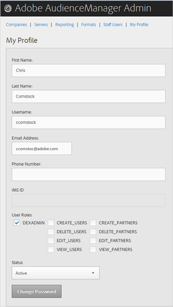
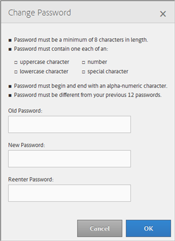

# Mon profil {#my-profile}

Modifiez les détails de votre profil d’outil d’administration Audience Manager ou modifiez votre mot de passe.

<!-- c_my_profile.xml -->

## Modifier le profil {#edit-profile}

Affichez et modifiez votre profil d’outil d’administration Audience Manager, y compris le prénom et le nom d’utilisateur, l’adresse électronique, le numéro de téléphone, l’[!UICONTROL IMS ID], les rôles utilisateur et le statut.

<!-- t_edit_profile.xml -->

1. Cliquez sur **[!UICONTROL My Profile]**.

   

2. Renseignez les champs suivants :
   * **[!UICONTROL First Name]:** (obligatoire) indiquez votre prénom.
   * **[!UICONTROL Last Name]:** (obligatoire) indiquez votre nom de famille.
   * **[!UICONTROL Username]:** (obligatoire) indiquez votre premier nom d’utilisateur.
   * **[!UICONTROL Email Address]:** (obligatoire) indiquez votre adresse e-mail.
   * **[!UICONTROL Phone Number]:** Indiquez votre numéro de téléphone.
   * **[!UICONTROL IMS ID]:** indiquez votre ID de service de messagerie Internet.
   * **[!UICONTROL User Roles]:** sélectionnez les rôles utilisateur de votre choix :
      * **[!UICONTROL DEXADMIN]:** permet à l’administrateur d’effectuer des tâches dans l’outil d’administration Audience Manager. Si vous ne sélectionnez pas cette option, vous pouvez choisir des rôles individuels. Ces rôles permettent aux utilisateurs d’effectuer des tâches à l’aide d’appels [!DNL API], mais pas dans l’outil Admin.
      * **[!UICONTROL CREATE_USERS]:** permet aux utilisateurs de créer de nouveaux utilisateurs à l’aide d’un appel [!DNL API].
      * **[!UICONTROL DELETE_USERS]:** permet aux utilisateurs de supprimer des utilisateurs existants à l’aide d’un appel [!DNL API].
      * **[!UICONTROL EDIT_USERS]:** permet aux utilisateurs de modifier des utilisateurs existants à l’aide d’un appel [!DNL API].
      * **[!UICONTROL VIEW_USERS]:** permet aux utilisateurs d’afficher d’autres utilisateurs dans votre configuration Audience Manager à l’aide d’un appel [!DNL API].
      * **[!UICONTROL CREATE_PARTNERS]:** permet aux utilisateurs de créer des partenaires Audience Manager à l’aide d’un appel [!DNL API].
      * **[!UICONTROL DELETE_PARTNERS]:** permet aux utilisateurs de supprimer des partenaires Audience Manager à l’aide d’un appel [!DNL API].
      * **[!UICONTROL EDIT_PARTNERS]:** permet aux utilisateurs de modifier des partenaires Audience Manager à l’aide d’un appel [!DNL API].
      * **[!UICONTROL VIEW_PARNTERS]:** permet aux utilisateurs d’afficher les partenaires Audience Manager à l’aide d’un appel [!DNL API].
   * **[!UICONTROL Status]:** sélectionnez le statut souhaité :
      * **[!UICONTROL Active]:** indique que cet utilisateur fait partie d’un groupe Audience Manager actif.
      * **[!UICONTROL Deactivated]:** indique que cet utilisateur est un utilisateur désactivé dans la gestion de l’audience.
      * **[!UICONTROL Expired]:** indique que le compte de cet utilisateur dans Audience Manager a expiré.
      * **[!UICONTROL Locked Out]:** indique que le compte de cet utilisateur dans Audience Manager est verrouillé.
3. Cliquez sur **[!UICONTROL Submit]**.

## Modifier le mot de passe {#change-password}

Modifiez le mot de passe de l’outil d’administration Audience Manager.

<!-- t_change_password.xml -->

1. Cliquez sur **[!UICONTROL My Profile]**.
1. Cliquez sur **[!UICONTROL Change Password]**.

   

   Votre mot de passe Audience Manager doit être :

   * au moins huit caractères ;
   * contiennent au moins un caractère majuscule ;
   * contiennent au moins un caractère minuscule ;
   * contiennent au moins un chiffre ;
   * contiennent au moins un caractère spécial ;
   * Commencez et terminez par un caractère alphanumérique ;
   * Commencez et terminez par un caractère alphanumérique.

1. Indiquez votre ancien mot de passe.
1. Indiquez votre nouveau mot de passe, puis confirmez-le.
1. Cliquez sur **[!UICONTROL OK]**.
