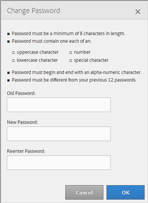

# Mon profil {#my-profile}

Modifiez les détails de votre profil d’outil d’administration des Audiences Manager ou modifiez votre mot de passe.

<!-- c_my_profile.xml -->

## Modifier le profil {#edit-profile}

Affichez et modifiez votre profil d’outil d’administration des Audiences Manager, y compris le prénom et le nom, le nom d’utilisateur, l’adresse électronique, le numéro de téléphone, [!UICONTROL IMS ID], les rôles utilisateur et l’état.

<!-- t_edit_profile.xml -->

1. Cliquez sur **[!UICONTROL My Profile]**.

   

2. Renseignez les champs suivants :
   * **[!UICONTROL First Name]:**  (obligatoire) indiquez votre prénom.
   * **[!UICONTROL Last Name]:**  (obligatoire) indiquez votre nom.
   * **[!UICONTROL Username]:**  (obligatoire) indiquez votre premier nom d’utilisateur.
   * **[!UICONTROL Email Address]:**  (Obligatoire) Indiquez votre adresse électronique.
   * **[!UICONTROL Phone Number]:** indiquez votre numéro de téléphone.
   * **[!UICONTROL IMS ID]:** indiquez votre ID de service de messagerie Internet.
   * **[!UICONTROL User Roles]:** sélectionnez les rôles d’utilisateur de votre choix :
      * **[!UICONTROL DEXADMIN]:** permet aux administrateurs d’effectuer des tâches dans l’outil d’administration des Audiences Manager. Si vous ne sélectionnez pas cette option, vous pouvez choisir des rôles individuels. Ces rôles permettent aux utilisateurs d’effectuer des tâches à l’aide d’appels [!DNL API], mais pas dans l’outil d’administration.
      * **[!UICONTROL CREATE_USERS]:** permet aux utilisateurs de créer des utilisateurs à l’aide d’un  [!DNL API] appel.
      * **[!UICONTROL DELETE_USERS]:** permet aux utilisateurs de supprimer des utilisateurs existants à l’aide d’un  [!DNL API] appel.
      * **[!UICONTROL EDIT_USERS]:** permet aux utilisateurs de modifier des utilisateurs existants à l’aide d’un  [!DNL API] appel.
      * **[!UICONTROL VIEW_USERS]:** permet aux utilisateurs d’afficher d’autres utilisateurs dans votre configuration d’Audience Manager à l’aide d’un  [!DNL API] appel.
      * **[!UICONTROL CREATE_PARTNERS]:** permet aux utilisateurs de créer des partenaires d’Audience Manager à l’aide d’un  [!DNL API] appel.
      * **[!UICONTROL DELETE_PARTNERS]:** permet aux utilisateurs de supprimer des partenaires d’Audience Manager à l’aide d’un  [!DNL API] appel.
      * **[!UICONTROL EDIT_PARTNERS]:** permet aux utilisateurs de modifier les partenaires d’Audience Manager à l’aide d’un  [!DNL API] appel.
      * **[!UICONTROL VIEW_PARNTERS]:** permet aux utilisateurs d’afficher les partenaires d’Audience Manager à l’aide d’un  [!DNL API] appel.
   * **[!UICONTROL Status]:**  sélectionnez un état :
      * **[!UICONTROL Active]:** indique que cet utilisateur appartient à un utilisateur d’Audience Manager principal.
      * **[!UICONTROL Deactivated]:** indique que cet utilisateur est un utilisateur désactivé dans la gestion de l’audience.
      * **[!UICONTROL Expired]:** indique que le compte de cet utilisateur en Audience Manager a expiré.
      * **[!UICONTROL Locked Out]:** indique que le compte de cet utilisateur en Audience Manager est verrouillé.
3. Cliquez sur **[!UICONTROL Submit]**.

## Modifier le mot de passe {#change-password}

Modifiez le mot de passe de l’outil d’administration des Audiences Manager.

<!-- t_change_password.xml -->

1. Cliquez sur **[!UICONTROL My Profile]**.
1. Cliquez sur **[!UICONTROL Change Password]**.

   

   Le mot de passe de votre Audience Manager doit être :

   * Au moins huit caractères ;
   * Contenir au moins un caractère majuscule ;
   * contenir au moins un caractère minuscule ;
   * contenir au moins un nombre ;
   * contenir au moins un caractère spécial ;
   * Commencer et se terminer par un caractère alphanumérique ;
   * Commencez et terminez par un caractère alphanumérique.

1. Indiquez votre ancien mot de passe.
1. Indiquez votre nouveau mot de passe, puis confirmez-le.
1. Cliquez sur **[!UICONTROL OK]**.
