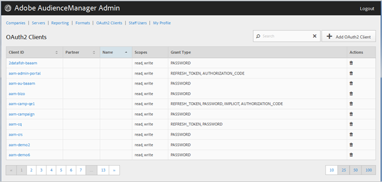

# Clients OAuth2 {#oauth-clients}

Utilisez la page [!UICONTROL OAuth2 Clients] pour vue une liste de clients [!UICONTROL OAuth2] dans votre configuration [!DNL Audience Manager]. Vous pouvez modifier ou supprimer des clients existants ou créer de nouveaux clients, à condition que les rôles d’utilisateur appropriés vous soient attribués.

## Présentation {#overview}

<!-- c_oauth.xml -->

>[!NOTE]
>
>Assurez-vous que votre client lit la documentation [OAuth2](https://docs.adobe.com/content/help/en/audience-manager/user-guide/api-and-sdk-code/rest-apis/aam-api-getting-started.html#oauth) dans le Guide de l’utilisateur de l’Audience Manager.

[!DNL OAuth2] est une norme ouverte pour l&#39;autorisation de fournir un accès délégué sécurisé aux  [!DNL Audience Manager] ressources au nom d&#39;un propriétaire de ressources.

Vous pouvez trier chaque colonne par ordre croissant ou décroissant en cliquant sur l’en-tête de la colonne de votre choix.

Utilisez la zone [!UICONTROL Search] ou les commandes de pagination au bas de la liste pour trouver le client souhaité.

## Créer ou modifier un client OAuth2 {#create-edit-client}

<!-- t_create_edit_auth.xml -->

Utilisez la page [!UICONTROL OAuth2 Clients] de l&#39;outil Audience Manager [!UICONTROL Admin] pour créer un nouveau client [!UICONTROL Oauth2] ou pour modifier un client existant.

1. Pour créer un nouveau client [!UICONTROL OAuth2], cliquez sur **[!UICONTROL OAuth2 Clients]** > **[!UICONTROL Add OAuth2 Client]**. Pour modifier un client [!UICONTROL OAuth2] existant, cliquez sur le client souhaité dans la colonne **[!UICONTROL Client ID]**.
1. Indiquez le nom souhaité pour ce client [!UICONTROL OAuth2]. Notez qu’il s’agit d’un nom pour l’enregistrement uniquement.
1. Indiquez l’adresse électronique du client [!UICONTROL OAuth2]. Il existe une limite d&#39;une adresse électronique.
1. Dans la liste déroulante **[!UICONTROL Partner]**, sélectionnez le partenaire de votre choix.
1. Dans la zone **[!UICONTROL Client ID]**, indiquez l’identifiant de votre choix. Il s’agit de la valeur utilisée lors de l’envoi de demandes [!DNL API]. Le préfixe est renseigné automatiquement lorsque vous début de saisir une valeur après avoir choisi [!UICONTROL Partner] dans la liste déroulante de l’étape précédente. Le format correct est &lt; *`partner subdomain`* - &lt; &lt;a1/&quot;.*`Audience Manager username`*
1. Cochez ou désélectionnez la case **[!UICONTROL Restrict to Partner Users]**, selon vos besoins. Si cette case est cochée, l&#39;utilisateur doit être un utilisateur [!DNL Audience Manager] répertorié pour le partenaire sélectionné. Il est recommandé de sélectionner cette option.
1. Dans la section **[!UICONTROL Scope]**, cochez ou désélectionnez les cases **[!UICONTROL Read]** et **[!UICONTROL Write]**, selon vos besoins.
1. Dans la section **[!UICONTROL Grant Type]**, sélectionnez les moyens d&#39;autorisation souhaités. Nous vous recommandons d&#39;utiliser les paramètres par défaut des options [!UICONTROL Password] et [!UICONTROL Refresh-token].

   * **[!UICONTROL Implicit]**: Si vous sélectionnez cette option, la  [!UICONTROL Redirect URI] zone est activée. L’utilisateur reçoit un jeton d&#39;accès automatique après son authentification et est immédiatement envoyé à la redirection [!DNL URI].
   * **[!UICONTROL Authorization Code]**: Si vous sélectionnez cette option, la  [!UICONTROL Redirect URI] zone est activée. L’utilisateur est renvoyé au client après avoir été authentifié, puis envoyé à la redirection [!DNL URI].
   * **[!UICONTROL Password]**: L’utilisateur est authentifié avec un mot de passe saisi par l’utilisateur plutôt qu’avec une tentative de validation automatique via un serveur d’autorisations.
   * **[!UICONTROL Refresh_token]**: Utilisé pour actualiser un jeton d&#39;accès expiré pendant une longue période.

1. Dans la zone **[!UICONTROL Redirect URI]**, indiquez le [!DNL URI] de votre choix. Cette option n’est activée que si vous sélectionnez les types d’octroi **[!UICONTROL Implicit]** et **[!UICONTROL Authorization_code]**. La zone **[!UICONTROL Redirect URI]** vous permet de spécifier une valeur séparée par des virgules de valeurs [!DNL URI] acceptables. Il s&#39;agit de la [!DNL URI] à laquelle un utilisateur d&#39;un client est redirigé après avoir approuvé le client pour l&#39;accès [!DNL API].
1. Spécifiez la durée d’expiration souhaitée (en secondes) pour l’accès et l’actualisation de l’expiration du jeton.

   * **[!UICONTROL Access Token Expiration Time]**: Nombre de secondes pendant lesquelles un jeton d&#39;accès est valide après avoir été émis. Peut être nul pour utiliser la plate-forme par défaut (12 heures). Peut également être égal à -1 pour indiquer que le jeton d&#39;accès n’expire pas.
   * **[!UICONTROL Refresh Token Expiration Time]**: Nombre de secondes pendant lesquelles un jeton d’actualisation est valide après avoir été émis. Peut être nul pour utiliser la plate-forme par défaut (30 jours).

1. Cliquez sur **[!UICONTROL Save]**.

Pour supprimer un client [!UICONTROL OAuth2], cliquez sur **[!UICONTROL OAuth2 Clients]**, puis sur  dans la colonne **[!UICONTROL Actions]** du client concerné.

>[!MORELIKETHIS]
>
>* [Configuration requise et recommandations pour l’API](../admin-oauth2/aam-admin-api-requirements.md)

