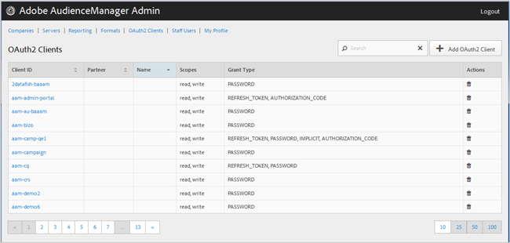

# Clients OAuth2 {#oauth-clients}

Utilisez la page [!UICONTROL OAuth2 Clients] pour afficher la liste des clients [!UICONTROL OAuth2] dans votre configuration [!DNL Audience Manager]. Vous pouvez modifier ou supprimer des clients existants ou en créer de nouveaux, à condition que les rôles utilisateur appropriés vous soient attribués.

## Présentation {#overview}

<!-- c_oauth.xml -->

>[!NOTE]
>
>Assurez-vous que votre client lit la documentation [OAuth2](https://experienceleague.adobe.com/docs/audience-manager/user-guide/api-and-sdk-code/rest-apis/aam-api-getting-started.html?lang=fr#oauth) dans le Guide de l’utilisateur d’Audience Manager.

[!DNL OAuth2] est une norme ouverte pour l’autorisation de fournir un accès délégué sécurisé à des ressources [!DNL Audience Manager] au nom d’un propriétaire de ressources.

Vous pouvez trier chaque colonne par ordre croissant ou décroissant en cliquant sur l’en-tête de la colonne souhaitée.

Utilisez la zone de [!UICONTROL Search] ou les commandes de pagination au bas de la liste pour trouver le client souhaité.

## Créer ou modifier un client OAuth2 {#create-edit-client}

<!-- t_create_edit_auth.xml -->

Utilisez la page [!UICONTROL OAuth2 Clients] de l’outil de [!UICONTROL Admin] d’Audience Manager pour créer un client [!UICONTROL Oauth2] ou modifier un client existant.

1. Pour créer un client [!UICONTROL OAuth2], cliquez sur **[!UICONTROL OAuth2 Clients]** > **[!UICONTROL Add OAuth2 Client]**. Pour modifier un client [!UICONTROL OAuth2] existant, cliquez sur le client de votre choix dans la colonne **[!UICONTROL Client ID]** .
1. Spécifiez le nom souhaité pour ce client [!UICONTROL OAuth2]. Notez qu’il s’agit d’un nom pour l’enregistrement uniquement.
1. Indiquez l’adresse e-mail du client [!UICONTROL OAuth2]. Une adresse e-mail est limitée.
1. Dans la liste déroulante **[!UICONTROL Partner]** , sélectionnez le partenaire souhaité.
1. Dans la zone de **[!UICONTROL Client ID]**, indiquez l’identifiant souhaité. Il s’agit de la valeur utilisée lors de l’envoi de requêtes [!DNL API]. Le préfixe est automatiquement renseigné lorsque vous commencez à saisir du texte après avoir choisi un [!UICONTROL Partner] dans la liste déroulante de l’étape précédente. Le format correct est &lt; *`partner subdomain`*> - &lt; *`Audience Manager username`*>.
1. Cochez ou désélectionnez la case **[!UICONTROL Restrict to Partner Users]**, selon vos besoins. Si cette case à cocher est activée, l’utilisateur doit être un utilisateur [!DNL Audience Manager] répertorié pour le partenaire sélectionné. Il est recommandé de sélectionner cette option.
1. Dans la section **[!UICONTROL Scope]**, sélectionnez ou désélectionnez les cases à cocher **[!UICONTROL Read]** et **[!UICONTROL Write]**, selon vos besoins.
1. Dans la section **[!UICONTROL Grant Type]** , sélectionnez les moyens d’autorisation souhaités. Nous vous recommandons d’utiliser les paramètres par défaut des options [!UICONTROL Password] et [!UICONTROL Refresh-token].

   * **[!UICONTROL Implicit]** : si vous sélectionnez cette option, la zone de [!UICONTROL Redirect URI] est activée. Un jeton d’accès automatique est attribué à l’utilisateur après son authentification et il est immédiatement envoyé au [!DNL URI] de redirection.
   * **[!UICONTROL Authorization Code]** : si vous sélectionnez cette option, la zone de [!UICONTROL Redirect URI] est activée. L’utilisateur est renvoyé au client après son authentification, puis envoyé au [!DNL URI] de redirection.
   * **[!UICONTROL Password]** : l’utilisateur est authentifié avec un mot de passe saisi par l’utilisateur plutôt qu’avec une tentative de validation automatique via un serveur d’autorisation.
   * **[!UICONTROL Refresh_token]** : utilisé pour actualiser un jeton d’accès expiré pendant une période prolongée.

1. Dans la zone de **[!UICONTROL Redirect URI]**, spécifiez le [!DNL URI] souhaité. Cette option est activée uniquement si vous sélectionnez les types d’octrois **[!UICONTROL Implicit]** et **[!UICONTROL Authorization_code]**. La zone de **[!UICONTROL Redirect URI]** vous permet de spécifier une valeur séparée par des virgules de valeurs de [!DNL URI] acceptables. Il s’agit de la [!DNL URI] vers laquelle un utilisateur ou une utilisatrice d’un client est redirigé après avoir approuvé l’accès du client ou de la cliente au [!DNL API].
1. Spécifiez le délai d’expiration souhaité (en secondes) pour l’accès et l’expiration du jeton d’actualisation.

   * **[!UICONTROL Access Token Expiration Time]** : nombre de secondes pendant lesquelles un jeton d’accès est valide après avoir été émis. Peut être nul pour utiliser la plateforme par défaut (12 heures). Peut également être -1 pour indiquer que le jeton d’accès n’expire pas.
   * **[!UICONTROL Refresh Token Expiration Time]** : nombre de secondes pendant lesquelles un jeton d’actualisation est valide après avoir été émis. Peut être nul pour utiliser la plateforme par défaut (30 jours).

1. Cliquez sur **[!UICONTROL Save]**.

Pour supprimer un client [!UICONTROL OAuth2], cliquez sur **[!UICONTROL OAuth2 Clients]**, puis sur  dans la colonne **[!UICONTROL Actions]** du client souhaité.

>[!MORELIKETHIS]
>
>* [Configuration requise et recommandations pour l’API](../admin-oauth2/aam-admin-api-requirements.md)
