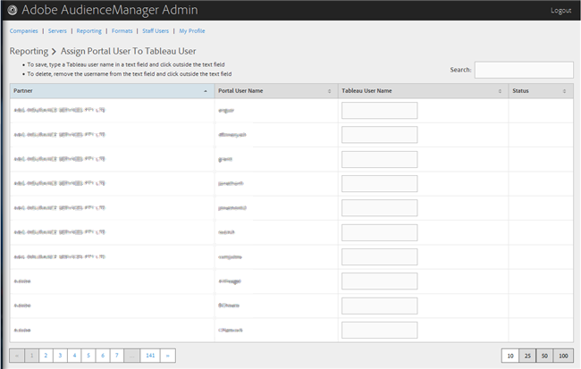

# Affectation d&#39;un utilisateur de portail à un utilisateur Tableau {#assign-a-portal-user-to-tableau-user}

<!-- t_tabeau.xml -->

Utilisez la page [!UICONTROL Reporting] pour faire d’un utilisateur du portail un utilisateur [!DNL Tableau]. Cela permet aux utilisateurs d’afficher des rapports [!DNL Tableau] dans Audience Manager.

1. Cliquez sur **[!UICONTROL Reporting]** > **[!UICONTROL Assign Portal User to Tableau User]**.

   

1. Pour affecter un utilisateur, dans la ligne de partenaire souhaitée, saisissez un nom d’utilisateur [!DNL Tableau] dans le champ de texte, puis cliquez en dehors du champ de texte.

Pour supprimer une affectation d’utilisateur, dans la ligne de partenaire souhaitée, supprimez le nom d’utilisateur du champ de texte, puis cliquez en dehors du champ de texte.
