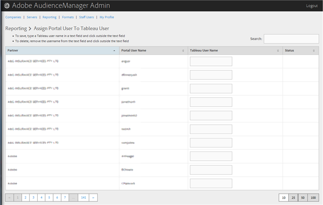

# Affecter un utilisateur du portail à un utilisateur Tableau {#assign-a-portal-user-to-tableau-user}

<!-- t_tabeau.xml -->

Utilisez la [!UICONTROL Reporting] page pour transformer un utilisateur du portail en [!DNL Tableau] utilisateur. Cela permet aux utilisateurs d’afficher [!DNL Tableau] les rapports dans Audience Manager.

1. Click **[!UICONTROL Reporting]** &gt; **[!UICONTROL Assign Portal User to Tableau User]**.

   

1. Pour affecter un utilisateur, entrez un [!DNL Tableau] nom d’utilisateur dans le champ de texte de la ligne de partenaire souhaitée, puis cliquez en dehors du champ de texte.

Pour supprimer une identité d’utilisateur, supprimez le nom d’utilisateur du champ de texte dans la ligne de partenaire souhaitée, puis cliquez en dehors du champ de texte.
