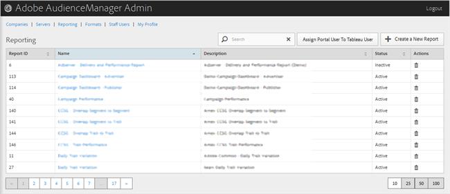

# Création de rapports {#reporting}

Gérez les rapports d’Audience Manager en créant de nouveaux rapports ou en modifiant ou supprimant des rapports existants. Vous pouvez également affecter un utilisateur du portail en tant qu’utilisateur [!DNL Tableau].

<!-- c_reporting.xml -->

Vous pouvez trier chaque colonne par ordre croissant ou décroissant en cliquant sur l’en-tête de la colonne de votre choix.

Utilisez la zone [!UICONTROL Search] ou les commandes de pagination en bas de la liste pour trouver le rapport souhaité.
