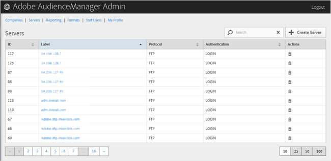

# Présentation des serveurs {#servers-overview}

Utilisez la page [!UICONTROL Servers] pour afficher la liste des serveurs dans la configuration de votre Audience Manager. Vous pouvez modifier ou supprimer des serveurs existants ou créer de nouveaux serveurs, à condition que les rôles utilisateur appropriés soient attribués à vous.

<!-- c_servers.xml -->

Vous pouvez trier chaque colonne par ordre croissant ou décroissant en cliquant sur l’en-tête de la colonne de votre choix. Utilisez la zone [!UICONTROL Search] ou les commandes de pagination en bas de la liste pour trouver le serveur souhaité.
