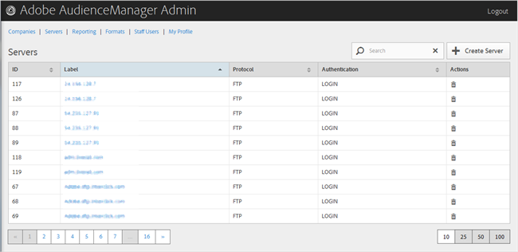

# Présentation des serveurs {#servers-overview}

Utilisez la page [!UICONTROL Servers] pour afficher la liste des serveurs de votre configuration Audience Manager. Vous pouvez modifier ou supprimer des serveurs existants ou en créer de nouveaux, à condition que les rôles utilisateur appropriés vous soient attribués.

<!-- c_servers.xml -->

Vous pouvez trier chaque colonne par ordre croissant ou décroissant en cliquant sur l’en-tête de la colonne souhaitée. Utilisez la zone de [!UICONTROL Search] ou les commandes de pagination au bas de la liste pour trouver le serveur souhaité.
