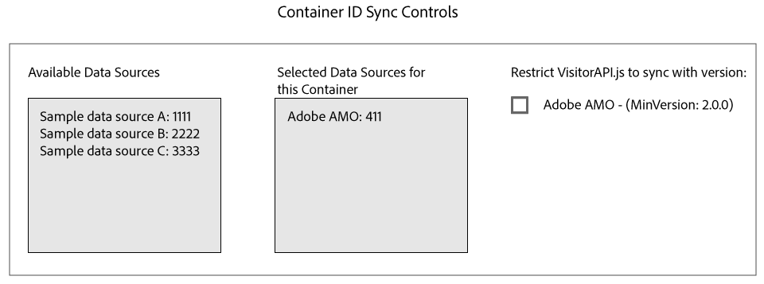

# Synchronisation des identifiants avec Media Optimizer {#id-syncing-with-media-optimizer}

Par défaut, toutes les entreprises synchronisent les données avec [!DNL Adobe Media Optimizer] ([!DNL AMO]). Dans le [!UICONTROL Admin UI], chaque conteneur d’entreprise possède une source de données qui gère ce processus. Cette source de données est [!UICONTROL Adobe AMO] ([!UICONTROL ID] 411). Cliquez sur une ligne de conteneur (sous l’ [!UICONTROL Containers] onglet) pour une société sélectionnée afin de désactiver cette synchronisation par défaut ou d’ajouter et de supprimer d’autres sources de données au processus de [!DNL AMO] synchronisation.

## État de la synchronisation des identifiants {#id-sync-status}

Le tableau suivant décrit l’état de synchronisation d’une source de données.

| État | Description |
|------ | -------- |
| Off | Supprimez toutes les sources de données de [!UICONTROL Selected Data Sources] ce conteneur pour désactiver la synchronisation des identifiants avec [!DNL AMO] |
| Activé (quelle que soit la version du service d’ID) | Une source de données se synchronise avec [!DNL AMO] quelle que soit la version du service d’ID lorsque : <ul><li>La source de données apparaît dans la [!UICONTROL Selected Data Sources] liste.</li><li>La [!DNL AMO] case à cocher n’ *est pas* sélectionnée.</li></ul> |
| Activé (quelle que soit la version du service d’ID) | Une source de données est synchronisée avec [!DNL AMO] la version 2.0 (ou ultérieure) du service d’ID lorsque : <ul><li>La source de données apparaît dans la [!UICONTROL Selected Data Sources] liste.</li><li>La [!DNL AMO] case *est* cochée.</li></ul> |

>[!MORE_LIKE_This]
>
>* [Gestion des conteneurs](../companies/admin-manage-containers.md#task_61DB5CEECC5049DD8D059C642AC3F967)

