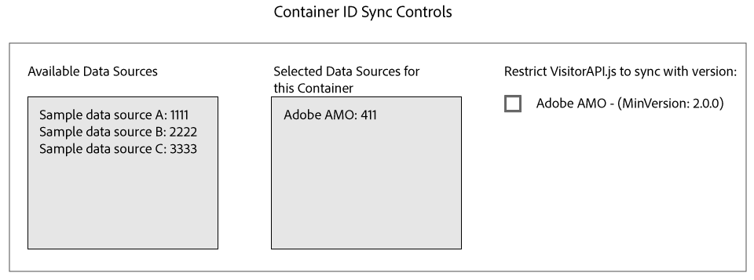

# Synchronisation des identifiants avec Adobe Media Optimizer {#id-syncing-with-media-optimizer}

Par défaut, toutes les entreprises synchronisent les données avec [!DNL Adobe Media Optimizer] ([!DNL AMO]). Dans le [!UICONTROL Admin UI], chaque conteneur d’entreprise dispose d’une source de données qui gère ce processus. Cette source de données est [!UICONTROL Adobe AMO] ([!UICONTROL ID] 411). Cliquez sur une ligne de conteneur (sous l’onglet [!UICONTROL Containers] ) d’une société sélectionnée pour désactiver cette synchronisation par défaut ou pour ajouter et supprimer d’autres sources de données au processus de synchronisation [!DNL AMO].

## Statut de synchronisation des identifiants {#id-sync-status}

Le tableau suivant décrit le statut de synchronisation d’une source de données.

| État | Description |
|------ | -------- |
| Off | Supprimez toutes les sources de données de [!UICONTROL Selected Data Sources] pour ce conteneur afin de désactiver les synchronisations des identifiants avec [!DNL AMO] |
| Activé (quelle que soit la version du service d’ID) | Une source de données se synchronise avec [!DNL AMO], quelle que soit la version du service d’ID lorsque : <ul><li>La source de données apparaît dans la liste [!UICONTROL Selected Data Sources].</li><li>La case à cocher [!DNL AMO] *n’est pas* sélectionnée.</li></ul> |
| Activé (quelle que soit la version du service d’ID) | Une source de données se synchronise avec [!DNL AMO] avec la version 2.0 (ou ultérieure) du service d’ID lorsque : <ul><li>La source de données apparaît dans la liste [!UICONTROL Selected Data Sources].</li><li>La case à cocher [!DNL AMO] *est* est sélectionnée.</li></ul> |

>[!MORELIKETHIS]
>
>* [Gestion des conteneurs](../companies/admin-manage-containers.md#task_61DB5CEECC5049DD8D059C642AC3F967)
