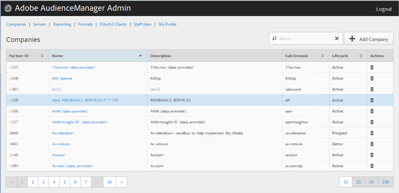

# Entreprises {#companies}

Utilisez la page [!UICONTROL Companies] pour vue une liste de sociétés dans votre configuration d&#39;Audience Manager. Vous pouvez modifier ou supprimer des sociétés existantes ou créer de nouvelles sociétés, à condition que les rôles d’utilisateur appropriés vous soient attribués.

Vous pouvez trier chaque colonne par ordre croissant ou décroissant en cliquant sur l’en-tête de la colonne de votre choix.

Utilisez la zone [!UICONTROL Search] ou les commandes de pagination au bas de la liste pour trouver la société souhaitée.
