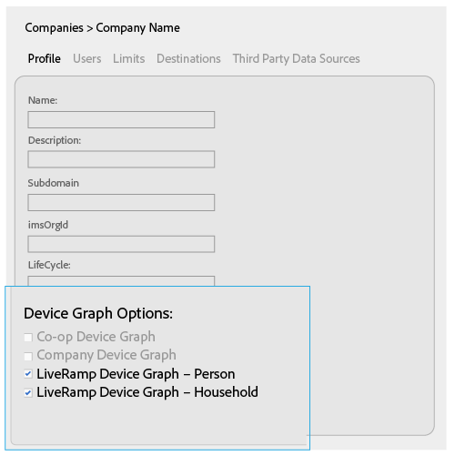
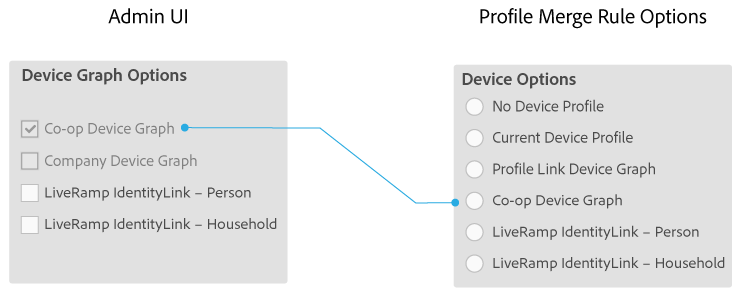
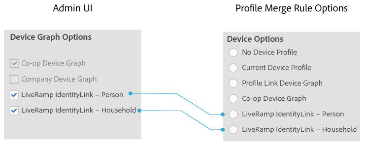

# Options graphiques de périphérique pour les entreprises {#device-graph-options-for-companies}

Les [!UICONTROL Device Graph Options] entreprises qui participent à [!DNL Adobe Experience Cloud Device Co-op]la section. Si un client entretient également une relation contractuelle avec un fournisseur de graphique de périphérique tiers intégré à Audience Manager, cette section affiche les options de ce graphique de périphérique. Ces options se trouvent dans [!UICONTROL Companies] &gt; nom de la société &gt; [!UICONTROL Profile] &gt; [!UICONTROL Device Graph Options].

Cette illustration utilise des noms génériques pour les options de graphique de périphérique tiers. En production, ces noms proviennent du fournisseur de graphique de l'appareil et peuvent varier d'un élément à l'autre. Par exemple, [!DNL LiveRamp] les options (mais pas toujours) :

* Commencez avec les sections "[!DNL LiveRamp]"
* Contient un nom au milieu variable
* Finir par « [!UICONTROL - Household]ou »[!UICONTROL -Person]

## Options graphiques de périphérique définies {#device-graph-options-defined}

Les options du graphique de périphérique que vous sélectionnez ici exposent ou masquent [!UICONTROL Device Options] les choix disponibles pour un [!DNL Audience Manager] client lors de sa création.[!UICONTROL Profile Merge Rule]

### Graphique de périphérique Co-op {#co-op-graph}

Les clients qui participent à [Adobe Experience Cloud Device Co-op](https://marketing.adobe.com/resources/help/en_US/mcdc/) utilisent ces options pour créer des [!UICONTROL Profile Merge Rule] données [neutres et probables](https://marketing.adobe.com/resources/help/en_US/mcdc/mcdc-links.html). Cette [!DNL Corporate Provisioning Team] option active et désactive cette option via [!DNL API] un appel principal. Vous ne pouvez pas cocher ces cases ou les effacer dans [!DNL Admin UI]le champ. Les options **[!UICONTROL Co-op Device Graph]** et **[!UICONTROL Company Device Graph]** les options sont également mutuellement exclusives. Les clients peuvent nous demander d'activer l'un ou l'autre, mais pas les deux. Lorsqu'elle est cochée, cette option expose le **[!UICONTROL Co-op Device Graph]** contrôle dans [!UICONTROL Device Options] les paramètres d'a [!UICONTROL Profile Merge Rule].

### Graphique de périphérique de l'entreprise {#company-graph}

Cette option est destinée [!DNL Analytics] aux clients qui utilisent [!UICONTROL People] la mesure dans leur [!DNL Analytics] suite de rapports. Cette [!DNL Corporate Provisioning Team] option active et désactive cette option via [!DNL API] un appel principal. Vous ne pouvez pas cocher ces cases ou les effacer dans [!DNL Admin UI]le champ. Les options **[!UICONTROL Company Device Graph]** et **[!UICONTROL Co-op Device Graph]** les options sont également mutuellement exclusives. Les clients peuvent nous demander d'activer l'un ou l'autre, mais pas les deux. Coché :

* Ce graphique de périphérique utilise des données déterministes appartenant à l'entreprise que vous configurez (aucune donnée probabiliste).
* [!DNL Audience Manager] crée automatiquement un [!UICONTROL Data Source] nom `*`de partenaire appelé`*-Company Device Graph-Person`. Dans la page [!UICONTROL Data Source] des détails, [!DNL Audience Manager] les clients peuvent modifier le nom du partenaire, la description et appliquer [les contrôles d'exportation de données](https://marketing.adobe.com/resources/help/en_US/aam/c_dec.html) à cette source de données.
* [!DNL Audience Manager] Les clients *ne voient* pas de nouveau paramètre dans [!UICONTROL Device Options] la section pour a [!UICONTROL Profile Merge Rule].

### Graphique de périphérique liveramp (personne ou foyer) {#liveramp-device-graph}

Ces cases à cocher sont activées dans le [!DNL Admin UI] moment où un partenaire crée et [!UICONTROL Data Source] sélectionne **[!UICONTROL Use as an Authenticated Profile]** et/ou **[!UICONTROL Use as a Device Graph]**. Les noms de ces paramètres sont déterminés par le fournisseur de graphique de périphérique tiers (par exemple [!DNL LiveRamp][!DNL TapAd], etc.). Lorsque cette option est cochée, la société que vous configurez va utiliser les données fournies par ces graphiques de périphérique.

>[!MORE_ LIKE_ THIS]
>
>* [Options de règle de fusion de profils définies](https://marketing.adobe.com/resources/help/en_US/aam/merge-rule-definitions.html)
>* [Paramètres de source de données et options de menu](https://marketing.adobe.com/resources/help/en_US/aam/datasource-settings-definitions.html)

