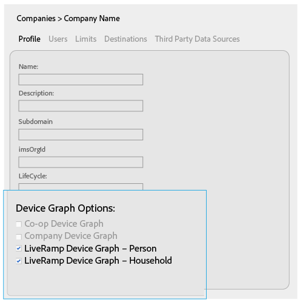
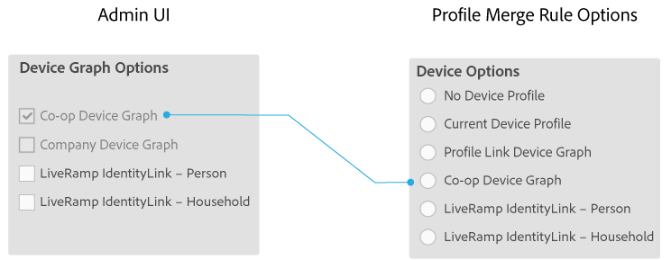
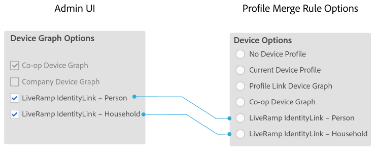

# Options de Device Graph pour les entreprises {#device-graph-options-for-companies}

Les [!UICONTROL Device Graph Options] sont disponibles pour les entreprises qui participent au [!DNL Adobe Experience Cloud Device Co-op]. Si un client entretient également une relation contractuelle avec un fournisseur de représentation graphique des appareils tiers intégré à Audience Manager, cette section affiche les options de cette représentation graphique des appareils. Ces options se trouvent dans [!UICONTROL Companies] > nom de la société > [!UICONTROL Profile] > [!UICONTROL Device Graph Options].

Cette illustration utilise des noms génériques pour les options de représentation graphique des appareils tiers. En production, ces noms proviennent du fournisseur de représentations graphiques des appareils et peuvent varier de ce qui est présenté ici. Par exemple, les options [!DNL LiveRamp] sont généralement (mais pas toujours) :

* Commencer par &quot;[!DNL LiveRamp]&quot;
* Contient un deuxième prénom qui varie
* Terminer par &quot;[!UICONTROL - Household]&quot; ou &quot;[!UICONTROL -Person]&quot;

## Options de Device Graph définies {#device-graph-options-defined}

Les options de Device Graph que vous sélectionnez ici exposent ou masquent les choix [!UICONTROL Device Options] disponibles pour un client [!DNL Audience Manager] lorsqu’il crée un [!UICONTROL Profile Merge Rule].

### Graphique d’appareil Co-op {#co-op-graph}

Les clients qui participent à la [Adobe Experience Cloud Device Co-op](https://experienceleague.adobe.com/docs/device-co-op/using/about/overview.html?lang=fr) utilisent ces options pour créer un [!UICONTROL Profile Merge Rule] avec des [ données déterministes et probabilistes](https://experienceleague.adobe.com/docs/device-co-op/using/device-graph/links.html?lang=fr). [!DNL Corporate Provisioning Team] active et désactive cette option via un appel [!DNL API] principal. Vous ne pouvez pas cocher ou décocher ces cases dans l’ [!DNL Admin UI]. En outre, les options **[!UICONTROL Co-op Device Graph]** et **[!UICONTROL Company Device Graph]** s’excluent mutuellement. Les clients peuvent nous demander d’activer l’un ou l’autre, mais pas les deux. Lorsque cette case est cochée, le contrôle **[!UICONTROL Co-op Device Graph]** est exposé dans les paramètres [!UICONTROL Device Options] pour un [!UICONTROL Profile Merge Rule].

### Graphique du périphérique de l’entreprise {#company-graph}

Cette option est destinée aux clients [!DNL Analytics] qui utilisent la mesure [!UICONTROL People] dans leur suite de rapports [!DNL Analytics]. [!DNL Corporate Provisioning Team] active et désactive cette option via un appel [!DNL API] principal. Vous ne pouvez pas cocher ou décocher ces cases dans l’ [!DNL Admin UI]. En outre, les options **[!UICONTROL Company Device Graph]** et **[!UICONTROL Co-op Device Graph]** s’excluent mutuellement. Les clients peuvent nous demander d’activer l’un ou l’autre, mais pas les deux. Lorsque cette case est cochée :

* Ce graphique d’appareil utilise des données déterministes appartenant à la société que vous configurez (aucune donnée probabiliste).
* [!DNL Audience Manager] crée automatiquement un [!UICONTROL Data Source] appelé `*`nom du partenaire`*-Company Device Graph-Person`. Sur la page de détails [!UICONTROL Data Source], les clients [!DNL Audience Manager] peuvent modifier le nom et la description du partenaire et appliquer des [ contrôles des exportations de données ](https://experienceleague.adobe.com/docs/device-co-op/using/device-graph/links.html?lang=fr) à cette source de données.
* [!DNL Audience Manager] clients *ne pas* voir un nouveau paramètre dans la section [!UICONTROL Device Options] pour un [!UICONTROL Profile Merge Rule].

### Graphique d’appareil LiveRamp (personne ou foyer) {#liveramp-device-graph}

Ces cases à cocher sont activées dans le [!DNL Admin UI] lorsqu’un partenaire crée un [!UICONTROL Data Source] et sélectionne **[!UICONTROL Use as an Authenticated Profile]** et/ou **[!UICONTROL Use as a Device Graph]**. Les noms de ces paramètres sont déterminés par le fournisseur de graphique d’appareil tiers (par exemple, [!DNL LiveRamp], [!DNL TapAd], etc.). Lorsque cette case est cochée, cela signifie que l’entreprise que vous configurez va utiliser les données fournies par ces représentations graphiques des appareils.

>[!MORELIKETHIS]
>
>* [Définition des options des stratégies de fusion de profils](https://experienceleague.adobe.com/docs/audience-manager/user-guide/features/profile-merge-rules/merge-rule-definitions.html?lang=fr)
>* [Paramètres de Source de données et options de menu](https://experienceleague.adobe.com/docs/audience-manager/user-guide/features/data-sources/datasources-list-and-settings.html?lang=fr)
