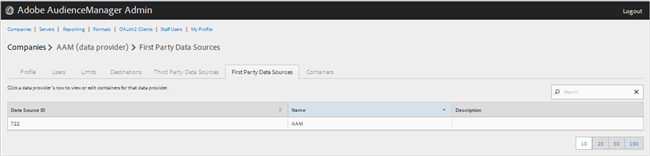
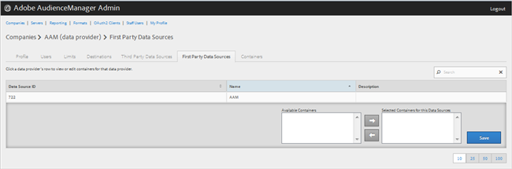

# Gestion des fournisseurs de données propriétaires {#manage-first-party-data-providers}

Affichez ou modifiez des conteneurs et des mappages pour les fournisseurs de données propriétaires.

<!-- t_first_party_providers.xml -->

1. Cliquez sur **[!UICONTROL Companies]**, puis localisez et cliquez sur la société souhaitée pour afficher sa page [!UICONTROL Profile]. Utilisez la zone [!UICONTROL Search] ou les commandes de pagination au bas de la liste pour trouver la société souhaitée. Vous pouvez trier chaque colonne par ordre croissant ou décroissant en cliquant sur l’en-tête de la colonne de votre choix.

1. Cliquez sur l’onglet **[!UICONTROL First Party Data Providers]** .

   

1. Cliquez sur la ligne d’un fournisseur de données pour afficher ou modifier des conteneurs et des mappages pour ce fournisseur de données.

   

1. Déplacez des conteneurs des listes **[!UICONTROL Available Containers]** et **[!UICONTROL Selected Containers for This Data Provider]** en sélectionnant les conteneurs souhaités, puis en cliquant sur les flèches droite ou gauche selon les besoins.
1. Cliquez sur **[!UICONTROL Save]** si vous avez apporté des modifications.
