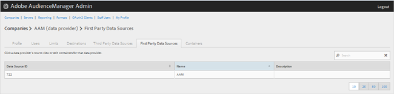

# Gérer les fournisseurs de données propriétaires {#manage-first-party-data-providers}

Affichez ou modifiez les conteneurs et les mappages pour les fournisseurs de données propriétaires.

<!-- t_first_party_providers.xml -->

1. Cliquez sur **[!UICONTROL Companies]**, puis recherchez et cliquez sur l’entreprise souhaitée pour afficher sa [!UICONTROL Profile] page. Utilisez la [!UICONTROL Search] zone ou les commandes de pagination au bas de la liste pour trouver la société souhaitée. Vous pouvez trier chaque colonne par ordre croissant ou décroissant en cliquant sur l’en-tête de la colonne de votre choix.

1. Click the **[!UICONTROL First Party Data Providers]** tab.

   

1. Cliquez sur la ligne d’un fournisseur de données pour afficher ou modifier des conteneurs et des mappages pour ce fournisseur de données.

   

1. Déplacez les conteneurs des listes **[!UICONTROL Available Containers]** et **[!UICONTROL Selected Containers for This Data Provider]** en sélectionnant les conteneurs souhaités, puis en cliquant sur les flèches vers la droite ou vers la gauche si nécessaire.
1. Cliquez sur **[!UICONTROL Save]** si vous avez apporté des modifications.