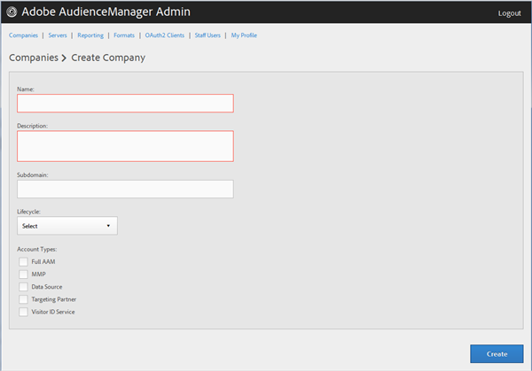

# Création d’un profil d’entreprise {#create-a-company-profile}

Utilisez la [!UICONTROL Companies] page de l’outil d’administration d’Audience Manager pour créer une société.

<!-- t_create_company.xml -->

>[!NOTE]
>
>Vous devez avoir le **[!UICONTROL DEXADMIN]** rôle de créer de nouvelles entreprises.

1. Click **[!UICONTROL Companies]** &gt; **[!UICONTROL Add Company]**.
1. Renseignez les champs suivants :

   * **[!UICONTROL Name]**: (Obligatoire) Indiquez le nom de la société.
   * **[!UICONTROL Description]**: (Obligatoire) Fournissez des informations descriptives sur l’entreprise, comme l’industrie ou son nom complet.
   * **[!UICONTROL Subdomain]**: (Obligatoire) Spécifiez le sous-domaine de l’entreprise. Le texte que vous saisissez correspond au sous-domaine de l’appel d’événement. Ça ne peut pas être changé. Il doit s’agir d’une chaîne de caractères [!DNL URL]valides.

      Par exemple, si votre société est nommée [!DNL AcmeCorp], le sous-domaine sera [!DNL acmecorp].

      Audience Manager utilise le sous-domaine pour le [!UICONTROL Data Collection Server]([!UICONTROL DCS]). Dans l'exemple précédent, si votre entreprise est pleine [!DNL URL] en [!UICONTROL DCS] serait [!DNL acmecorp.demdex.net].

   * **[!UICONTROL Lifecyle]**: Spécifiez l’étape souhaitée pour l’entreprise :
      * **[!UICONTROL Active]**: Indiquez que l’entreprise sera un client Audience Manager actif. Un [!UICONTROL Active] compte signifie un client payant, pas seulement pour le conseil, mais pour le SKU d’Audience Manager.
      * **[!UICONTROL Demo]**: Indiquez que l’entreprise sera réservée à des fins de démonstration. Les données de création de rapports seront automatiquement masquées.
      * **[!UICONTROL Prospect]**: Indiquez que l’entreprise est un client Audience Manager potentiel, tel qu’une société à laquelle est attribuée une configuration gratuite [!DNL POC] ou un compte pour une démonstration commerciale.
      * **[!UICONTROL Test]**: Indiquez que l’entreprise sera utilisée uniquement à des fins de test interne.
   * **[!UICONTROL Account Types]**: Spécifiez le jeu complet de types de compte pour cette entreprise. Aucun type de compte n’est mutuellement exclusif avec aucun autre type.
      * **[!UICONTROL Full AAM]**: Indiquez que l’entreprise aura un compte Adobe Audience Manager complet et que les utilisateurs auront un accès à la connexion.
      * **[!UICONTROL MMP]**: Indiquez que l’entreprise a été autorisée à utiliser les [!UICONTROL Master Marketing Profile] ([!UICONTROL MMP]) fonctionnalités. Le [!UICONTROL MMP] module permet aux audiences d’être partagées dans Experience Cloud à l’aide d’un [!UICONTROL Experience Cloud ID] ([!DNL MCID]) affecté à chaque visiteur, puis utilisé par Audience Manager. Si vous sélectionnez ce type de compte, la [!UICONTROL Experience Cloud ID Service] sélection s’effectue automatiquement.

         Pour plus d’informations, voir [Audiences Services - Profil](https://marketing.adobe.com/resources/help/en_US/mcloud/audience_library.html)marketing parent.
   * **[!UICONTROL Data Source]**: Indiquez que l’entreprise est un fournisseur de données tiers dans Audience Manager.
   * **[!UICONTROL Targeting Partner]**: Indiquez que l’entreprise agit comme plateforme de ciblage pour les clients d’Audience Manager.
   * **[!UICONTROL Visitor ID Service]**: Indiquez que l’entreprise a été autorisée à utiliser le [!UICONTROL Experience Cloud Visitor ID Service].

      Le [!UICONTROL Experience Cloud Visitor ID Service] fournit un identifiant visiteur universel pour toutes les solutions Experience Cloud. For more information, see the [Experience Cloud Visitor ID Service user guide](https://marketing.adobe.com/resources/help/en_US/mcvid/mcvid-overview.html).

   * **[!UICONTROL Agency]**: Indiquez si l’entreprise aura un [!UICONTROL Agency] compte.

1. Cliquez sur **[!UICONTROL Create]**. Suivez les instructions de la section [Modifier un profil](../companies/admin-manage-company-profiles.md#edit-company-profile)d’entreprise.

   

## Modification d’un profil d’entreprise {#edit-company-profile}

Modifiez le profil d’une entreprise, notamment son nom, sa description, son sous-domaine, son cycle de vie, etc.

<!-- t_edit_company_profile.xml -->

1. Cliquez sur **[!UICONTROL Companies]**, puis recherchez et cliquez sur l’entreprise souhaitée pour afficher sa [!UICONTROL Profile] page.

   Utilisez la [!UICONTROL Search] zone ou les commandes de pagination au bas de la liste pour trouver la société souhaitée. Vous pouvez trier chaque colonne par ordre croissant ou décroissant en cliquant sur l’en-tête de la colonne de votre choix.

   

1. Modifiez les champs selon les besoins : 

   * **[!UICONTROL Name]**: Modifiez le nom de la société. Il s’agit d’un champ obligatoire.
   * **[!UICONTROL Description]**: Modifiez la description de la société. Il s’agit d’un champ obligatoire.
   * **[!UICONTROL Subdomain]**: (Obligatoire) Spécifiez le sous-domaine de l’entreprise. Le texte que vous saisissez correspond au sous-domaine de l’appel d’événement. Ça ne peut pas être changé. Il doit s’agir d’une chaîne de caractères [!DNL URL]valides.

      Par exemple, si votre société est nommée [!DNL AcmeCorp], le sous-domaine sera [!DNL acmecorp].

      Audience Manager utilise le sous-domaine pour le [!UICONTROL Data Collection Server] ([!UICONTROL DCS]). Dans l'exemple précédent, si votre entreprise est pleine [!DNL URL] en [!UICONTROL DCS] serait [!DNL acmecorp.demdex.net].

   * **[!UICONTROL imsOrgld]**: ([!UICONTROL Identity Management System Organization ID]) Cet identifiant vous permet de connecter votre entreprise à Adobe Experience Cloud.
   * **[!UICONTROL Lifecyle]**: Spécifiez l’étape souhaitée pour l’entreprise :
      * **[!UICONTROL Active]**: Indiquez que l’entreprise sera un client Audience Manager actif. Un compte actif signifie un client payant, pas seulement pour consulter, mais pour le SKU d’Audience Manager.
      * **[!UICONTROL Demo]**: Indiquez que l’entreprise sera réservée à des fins de démonstration. Les données de création de rapports seront automatiquement masquées.
      * **[!UICONTROL Prospect]**: Indiquez que l’entreprise est un client Audience Manager potentiel, tel qu’une société à laquelle est attribuée une configuration gratuite [!DNL POC] ou un compte pour une démonstration commerciale.
      * **[!UICONTROL Test]**: Indiquez que l’entreprise sera utilisée uniquement à des fins de test interne.
   * **[!UICONTROL Account Types]**: Spécifiez le jeu complet de types de compte pour cette entreprise. Aucun type de compte n’est mutuellement exclusif avec aucun autre type.
      * **[!UICONTROL Full AAM]**: Indiquez que l’entreprise aura un compte Adobe Audience Manager complet et que les utilisateurs auront un accès à la connexion.
      * **[!UICONTROL MMP]**: Indiquez que l’entreprise a été autorisée à utiliser les fonctionnalités du profil marketing parent ([!UICONTROL MMP]).

         Si vous sélectionnez ce type de compte, **[!UICONTROL Visitor ID Service]** est également automatiquement sélectionné.
Pour plus d’informations, voir [Audiences Services - Profil](https://marketing.adobe.com/resources/help/en_US/mcloud/audience_library.html)marketing parent.
   * **[!UICONTROL Data Source]**: Indiquez que l’entreprise est un fournisseur de données tiers dans Audience Manager.
   * **[!UICONTROL Targeting Partner]**: Indiquez que l’entreprise agit comme plateforme de ciblage pour les clients d’Audience Manager.
   * **[!UICONTROL Visitor ID Service]**: Indiquez que l’entreprise a été autorisée à utiliser le service d’identification des visiteurs d’Experience Cloud.

      Le service d’identifiant visiteur Experience Cloud fournit un identifiant visiteur universel pour toutes les solutions Experience Cloud. For more information, see the [Experience Cloud Visitor ID Service user guide](https://microsite.omniture.com/t2/help/en_US/mcvid/mcvid_service.html).

   * **[!UICONTROL Agency]**: Indiquez si l’entreprise aura un compte de l’Agence.
   * **[!UICONTROL Features]**: Sélectionnez les options souhaitées:
      * **[!UICONTROL Password Expiration]**: Définit l’expiration de tous les mots de passe utilisateur au sein de cette entreprise après 90 jours afin d’accroître la sécurité d’Audience Manager.
      * **[!UICONTROL Reporting]**: Active les rapports Audience Manager pour cette entreprise.
      * **[!UICONTROL Role Based Access Controls]**: Activez les contrôles d’accès basés sur les rôles pour cette entreprise. Les contrôles d’accès basés sur les rôles vous permettent de créer des groupes d’utilisateurs avec des autorisations d’accès différentes. Les utilisateurs individuels de ces groupes peuvent alors accéder uniquement à des fonctionnalités spécifiques d’Audience Manager.

1. Cliquez sur **[!UICONTROL Submit Updates]**.

## Suppression d’un profil d’entreprise {#delete-company-profile}

Utilisez la [!UICONTROL Companies] page de l’outil Audience Manager [!UICONTROL Admin] pour supprimer une société existante.

<!-- t_delete_company.xml -->

>[!NOTE]
>
>Vous devez avoir le [!UICONTROL DEXADMIN] rôle de supprimer les entreprises existantes.

1. Pour supprimer une société existante, cliquez sur **[!UICONTROL Companies]**.

   

1. Cliquez  dans la **[!UICONTROL Actions]** colonne de la société souhaitée.
1. Cliquez sur **[!UICONTROL OK]pour confirmer la suppression.**
