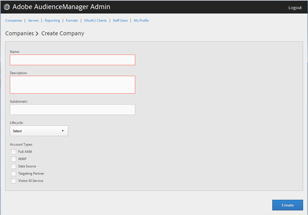
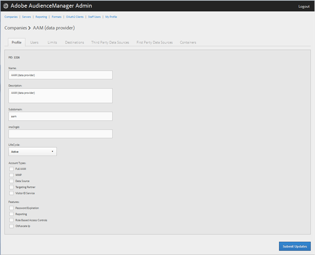
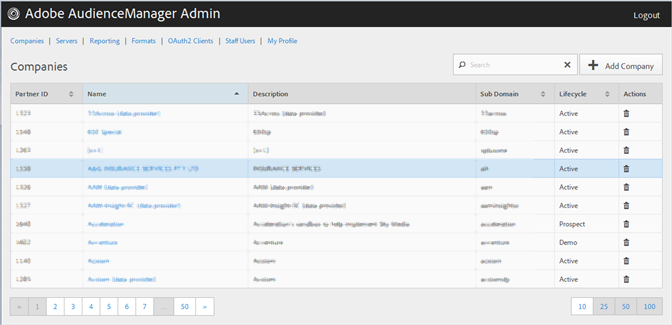

# Créer un profil d’entreprise {#create-a-company-profile}

Utilisez la page [!UICONTROL Companies] de l’outil d’administration Audience Manager pour créer une nouvelle société.

<!-- t_create_company.xml -->

>[!NOTE]
>
>Vous devez avoir le rôle **[!UICONTROL DEXADMIN]** pour créer de nouvelles entreprises.

1. Cliquez sur **[!UICONTROL Companies]** > **[!UICONTROL Add Company]**.
1. Renseignez les champs suivants :

   * **[!UICONTROL Name]** : (obligatoire) indiquez le nom de la société.
   * **[!UICONTROL Description]** : (Obligatoire) Fournissez des informations descriptives sur la société, telles que le secteur d’activité ou son nom complet.
   * **[!UICONTROL Subdomain]** : (obligatoire) spécifiez le sous-domaine de la société. Le texte que vous saisissez correspond au sous-domaine de l’appel d’événement. Ceci ne peut pas être modifié. Il doit s’agir d’une chaîne de caractères [!DNL URL] valides.

     Par exemple, si votre société a été nommée [!DNL AcmeCorp], le sous-domaine est [!DNL acmecorp].

     Audience Manager utilise le sous-domaine pour le [!UICONTROL Data Collection Server] (DCS). Dans l’exemple précédent, si la [!DNL URL] complète de votre entreprise dans [!UICONTROL DCS] est [!DNL acmecorp.demdex.net].

   * **[!UICONTROL Lifecyle]** : indiquez l’étape souhaitée pour la société :
      * **[!UICONTROL Active]** : indiquez que la société sera un client Audience Manager actif. Un compte [!UICONTROL Active] signifie un client payant, pas seulement pour ses conseils, mais pour le SKU Audience Manager.
      * **[!UICONTROL Demo]** : indiquez que la société sera créée à des fins de démonstration uniquement. Les données de rapport seront automatiquement falsifiées.
      * **[!UICONTROL Prospect]** : indiquez que la société est un client Audience Manager potentiel, par exemple si une société bénéficie d’une [!DNL POC] gratuite ou d’une configuration de compte pour une démonstration commerciale.
      * **[!UICONTROL Test]** : indiquez que la société sera à des fins de test interne uniquement.

   * **[!UICONTROL Account Types]** : spécifiez l’ensemble complet des types de compte pour cette société. Aucun type de compte ne s’exclut mutuellement avec un autre type.
      * **[!UICONTROL Full AAM]** : indiquez que la société disposera d’un compte Adobe Audience Manager complet et que les utilisateurs auront un accès de connexion.
      * **[!UICONTROL MMP]** : indiquez que la société a été autorisée à utiliser les fonctionnalités [!UICONTROL Master Marketing Profile] ([!UICONTROL MMP]). Le [!UICONTROL MMP] permet de partager des audiences dans l’ensemble d’Experience Cloud à l’aide d’un [!UICONTROL Experience Cloud ID] ([!DNL MCID]) attribué à chaque visiteur, puis utilisé par Audience Manager. Si vous sélectionnez ce type de compte, le [!UICONTROL Experience Cloud ID Service] est également automatiquement sélectionné.

        Pour plus d’informations, voir [Audiences ](https://experienceleague.adobe.com/docs/core-services/interface/services/audiences/audience-library.html?lang=en).

   * **[!UICONTROL Data Source]** : indiquez que la société est un fournisseur de données tiers dans Audience Manager.
   * **[!UICONTROL Targeting Partner]** : indiquez que la société agit comme une plateforme de ciblage pour les clients Audience Manager.
   * **[!UICONTROL Visitor ID Service]** : indiquez que la société a été autorisée à utiliser le [!UICONTROL Experience Cloud Visitor ID Service].

     Le [!UICONTROL Experience Cloud Visitor ID Service] fournit un identifiant visiteur universel pour toutes les solutions Experience Cloud. Pour plus d’informations, consultez le guide d’utilisation du service d’identification des visiteurs d’Experience Cloud .

   * **[!UICONTROL Agency]** : indiquez que la société disposera d’un compte [!UICONTROL Agency].

1. Cliquez sur **[!UICONTROL Create]**. Suivez les instructions de la section [ Modifier un profil d’entreprise ](../companies/admin-manage-company-profiles.md#edit-company-profile).

   

## Modifier un profil d’entreprise {#edit-company-profile}

Modifiez le profil d’une entreprise, y compris son nom, sa description, son sous-domaine, son cycle de vie, etc.

<!-- t_edit_company_profile.xml -->

1. Cliquez sur **[!UICONTROL Companies]**, puis recherchez et cliquez sur la société souhaitée pour afficher sa page [!UICONTROL Profile].

   Utilisez la boîte de [!UICONTROL Search] ou les commandes de pagination au bas de la liste pour trouver l’entreprise souhaitée. Vous pouvez trier chaque colonne par ordre croissant ou décroissant en cliquant sur l’en-tête de la colonne souhaitée.

   

1. Modifiez les champs selon vos besoins :

   * **[!UICONTROL Name]** : modifiez le nom de la société. Ce champ est obligatoire.
   * **[!UICONTROL Description]** : modifiez la description de la société. Ce champ est obligatoire.
   * **[!UICONTROL Subdomain]** : (obligatoire) spécifiez le sous-domaine de la société. Le texte que vous saisissez correspond au sous-domaine de l’appel d’événement. Ceci ne peut pas être modifié. Il doit s’agir d’une chaîne de caractères [!DNL URL] valides.

     Par exemple, si votre société a été nommée [!DNL AcmeCorp], le sous-domaine est [!DNL acmecorp].

     Audience Manager utilise le sous-domaine pour le [!UICONTROL Data Collection Server] (DCS). Dans l’exemple précédent, si la [!DNL URL] complète de votre entreprise dans [!UICONTROL DCS] est [!DNL acmecorp.demdex.net].

   * **[!UICONTROL imsOrgld]** : ([!UICONTROL Identity Management System Organization ID]) cet identifiant permet de connecter votre société au Adobe Experience Cloud.
   * **[!UICONTROL Lifecyle]** : indiquez l’étape souhaitée pour la société :
      * **[!UICONTROL Active]** : indiquez que la société sera un client Audience Manager actif. Un compte actif désigne un client payant, non seulement pour ses conseils, mais aussi pour le SKU Audience Manager.
      * **[!UICONTROL Demo]** : indiquez que la société sera créée à des fins de démonstration uniquement. Les données de rapport seront automatiquement falsifiées.
      * **[!UICONTROL Prospect]** : indiquez que la société est un client Audience Manager potentiel, par exemple si une société bénéficie d’une [!DNL POC] gratuite ou d’une configuration de compte pour une démonstration commerciale.
      * **[!UICONTROL Test]** : indiquez que la société sera à des fins de test interne uniquement.
   * **[!UICONTROL Account Types]** : spécifiez l’ensemble complet des types de compte pour cette société. Aucun type de compte ne s’exclut mutuellement avec un autre type.
      * **[!UICONTROL Full AAM]** : indiquez que la société disposera d’un compte Adobe Audience Manager complet et que les utilisateurs auront un accès de connexion.
      * **[!UICONTROL MMP]** : indiquez que la société a été autorisée à utiliser les fonctionnalités du profil marketing par Principal ([!UICONTROL MMP]).

        Si vous sélectionnez ce type de compte, **[!UICONTROL Visitor ID Service]** est également automatiquement sélectionné.
Pour plus d’informations, voir [Audiences ](https://experienceleague.adobe.com/docs/core-services/interface/services/audiences/audience-library.html?lang=en).

   * **[!UICONTROL Data Source]** : indiquez que la société est un fournisseur de données tiers dans Audience Manager.
   * **[!UICONTROL Targeting Partner]** : indiquez que la société agit comme une plateforme de ciblage pour les clients Audience Manager.
   * **[!UICONTROL Visitor ID Service]** : indiquez que la société a été autorisée à utiliser le service d’identification des visiteurs Experience Cloud.

     Le service d’identifiant visiteur Experience Cloud fournit un identifiant visiteur universel pour toutes les solutions Experience Cloud. Pour plus d’informations, consultez le guide d’utilisation du service Experience Cloud ID .

   * **[!UICONTROL Agency]** : indiquez que la société disposera d’un compte d’agence.
   * **[!UICONTROL Features]** : sélectionnez les options souhaitées :
      * **[!UICONTROL Password Expiration]** : définit tous les mots de passe utilisateur de cette société pour qu’ils expirent après 90 jours afin d’améliorer la sécurité d’Audience Manager.
      * **[!UICONTROL Reporting]** : active la création de rapports Audience Manager pour cette société.
      * **[!UICONTROL Role Based Access Controls]** : activez les contrôles d’accès en fonction du rôle pour cette entreprise. Les contrôles d’accès basés sur les rôles vous permettent de créer des groupes d’utilisateurs avec des autorisations d’accès différentes. Les utilisateurs individuels de ces groupes ne peuvent alors accéder qu’à des fonctionnalités spécifiques d’Audience Manager.

1. Cliquez sur **[!UICONTROL Submit Updates]**.

## Suppression d’un profil d’entreprise {#delete-company-profile}

Utilisez la page [!UICONTROL Companies] de l’outil de [!UICONTROL Admin] Audience Manager pour supprimer une société existante.

<!-- t_delete_company.xml -->

>[!NOTE]
>
>Vous devez disposer du rôle [!UICONTROL DEXADMIN] pour supprimer des sociétés existantes.

1. Pour supprimer une entreprise existante, cliquez sur **[!UICONTROL Companies]**.

   

1. Cliquez sur  dans la colonne **[!UICONTROL Actions]** de la société souhaitée.
1. Cliquez sur **[!UICONTROL OK]** pour confirmer la suppression.
