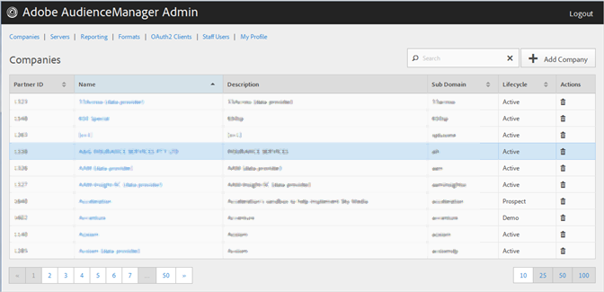

# Création d'un profil d'entreprise {#create-a-company-profile}

Utilisez [!UICONTROL Companies] la page de l'outil d'administration Audience Manager pour créer une société.

<!-- t_create_company.xml -->

>[!NOTE]
>
>Vous devez disposer du **[!UICONTROL DEXADMIN]** rôle pour créer de nouvelles entreprises.

1. Click **[!UICONTROL Companies]** &gt; **[!UICONTROL Add Company]**.
1. Renseignez les champs suivants :

   * **[!UICONTROL Name]**: (Obligatoire) Indiquez le nom de la société.
   * **[!UICONTROL Description]**: (Obligatoire) Fournissez des informations descriptives sur la société, telles que l'industrie ou son nom complet.
   * **[!UICONTROL Subdomain]**: (Obligatoire) Spécifiez le sous-domaine de l'entreprise. Le texte que vous saisissez est ce qui s'affiche comme sous-domaine de l'appel d'événement. Cette modification ne peut pas être modifiée. Il doit s'agir d'une chaîne [!DNL URL]de caractères -valid.

      Par exemple, si votre société a été nommée [!DNL AcmeCorp], le sous-domaine serait [!DNL acmecorp].

      Audience Manager utilise le sous-domaine pour la [!UICONTROL Data Collection Server]([!UICONTROL DCS]). Dans l'exemple précédent, si votre société n'est pas complètement [!DNL URL] dans [!UICONTROL DCS] l'exemple [!DNL acmecorp.demdex.net]suivant :

   * **[!UICONTROL Lifecyle]**: Spécifiez l'étape souhaitée pour la société :
      * **[!UICONTROL Active]**: Indiquez que la société sera un client Audience Manager actif. [!UICONTROL Active] Un compte désigne un client payant, pas seulement pour le conseil, mais pour le SKU Audience Manager.
      * **[!UICONTROL Demo]**: Indiquez que la société sera à titre de démonstration uniquement. Les données de rapport seront automatiquement faxées.
      * **[!UICONTROL Prospect]**: Indiquez que la société est un client potentiel Audience Manager, tel qu'une entreprise disposant d'une configuration gratuite [!DNL POC] ou de compte pour une démonstration commerciale.
      * **[!UICONTROL Test]**: Précisez que la société est à des fins de test interne uniquement.
   * **[!UICONTROL Account Types]**: Spécifiez l'ensemble complet des types de compte pour cette entreprise. Aucun type de compte n'est mutuellement : exclusif avec tout autre type.
      * **[!UICONTROL Full AAM]**: Indiquez que l'entreprise dispose d'un compte Adobe Audience Manager complet et que les utilisateurs disposent d'un accès de connexion.
      * **[!UICONTROL MMP]**: Indiquez que la société a été activée pour utiliser les fonctionnalités [!UICONTROL Master Marketing Profile] ([!UICONTROL MMP]). La [!UICONTROL MMP] fonction permet de partager les audiences dans Experience Cloud à l'aide d'un [!UICONTROL Experience Cloud ID] ([!DNL MCID]) qui est affecté à chaque visiteur puis utilisé par Audience Manager. Si vous sélectionnez ce type de compte, la sélection [!UICONTROL Experience Cloud ID Service] est également automatiquement sélectionnée.

         Pour plus d'informations, voir [Services d'audiences - Profil marketing principal](https://marketing.adobe.com/resources/help/en_US/mcloud/audience_library.html).
   * **[!UICONTROL Data Source]**: Indiquez que l'entreprise est un fournisseur de données tiers dans Audience Manager.
   * **[!UICONTROL Targeting Partner]**: Indiquez que la société joue le rôle de plateforme de ciblage pour les clients Audience Manager.
   * **[!UICONTROL Visitor ID Service]**: Indiquez que l'entreprise a été activée pour utiliser [!UICONTROL Experience Cloud Visitor ID Service]la variable.

      Ce [!UICONTROL Experience Cloud Visitor ID Service] paramètre fournit un identifiant visiteur universel dans les solutions Experience Cloud. For more information, see the [Experience Cloud Visitor ID Service user guide](https://marketing.adobe.com/resources/help/en_US/mcvid/mcvid-overview.html).

   * **[!UICONTROL Agency]**: Indiquez que la société aura un [!UICONTROL Agency] compte.

1. Cliquez sur **[!UICONTROL Create]**. Suivez les instructions de [la section Modification d'un profil d'entreprise](../companies/admin-manage-company-profiles.md#edit-company-profile).

   

## Modification d'un profil d'entreprise {#edit-company-profile}

Modifiez le profil d'une entreprise, notamment son nom, sa description, son sous-domaine, son cycle de vie, etc.

<!-- t_edit_company_profile.xml -->

1. Cliquez sur **[!UICONTROL Companies]**, puis localisez et cliquez sur la société souhaitée pour afficher sa [!UICONTROL Profile] page.

   Utilisez [!UICONTROL Search] la zone ou les commandes de pagination au bas de la liste pour trouver la société souhaitée. Vous pouvez trier chaque colonne par ordre croissant ou décroissant en cliquant sur l'en-tête de la colonne concernée.

   

1. Modifiez les champs selon les besoins : 

   * **[!UICONTROL Name]**: Modifiez le nom de la société. Il s'agit d'un champ obligatoire.
   * **[!UICONTROL Description]**: Modifiez la description de la société. Il s'agit d'un champ obligatoire.
   * **[!UICONTROL Subdomain]**: (Obligatoire) Spécifiez le sous-domaine de l'entreprise. Le texte que vous saisissez est ce qui s'affiche comme sous-domaine de l'appel d'événement. Cette modification ne peut pas être modifiée. Il doit s'agir d'une chaîne [!DNL URL]de caractères -valid.

      Par exemple, si votre société a été nommée [!DNL AcmeCorp], le sous-domaine serait [!DNL acmecorp].

      Audience Manager utilise le sous-domaine pour la [!UICONTROL Data Collection Server] ([!UICONTROL DCS]). Dans l'exemple précédent, si votre société n'est pas complètement [!DNL URL] dans [!UICONTROL DCS] l'exemple [!DNL acmecorp.demdex.net]suivant :

   * **[!UICONTROL imsOrgld]**: ([!UICONTROL Identity Management System Organization ID]) Cet ID vous permet de connecter votre société à Adobe Experience Cloud.
   * **[!UICONTROL Lifecyle]**: Spécifiez l'étape souhaitée pour la société :
      * **[!UICONTROL Active]**: Indiquez que la société sera un client Audience Manager actif. Un compte actif désigne un client payant, pas seulement pour le conseil, mais pour le SKU Audience Manager.
      * **[!UICONTROL Demo]**: Indiquez que la société sera à titre de démonstration uniquement. Les données de rapport seront automatiquement faxées.
      * **[!UICONTROL Prospect]**: Indiquez que la société est un client potentiel Audience Manager, tel qu'une entreprise disposant d'une configuration gratuite [!DNL POC] ou de compte pour une démonstration commerciale.
      * **[!UICONTROL Test]**: Précisez que la société est à des fins de test interne uniquement.
   * **[!UICONTROL Account Types]**: Spécifiez l'ensemble complet des types de compte pour cette entreprise. Aucun type de compte n'est mutuellement : exclusif avec tout autre type.
      * **[!UICONTROL Full AAM]**: Indiquez que l'entreprise dispose d'un compte Adobe Audience Manager complet et que les utilisateurs disposent d'un accès de connexion.
      * **[!UICONTROL MMP]**: Indiquez que la société a été activée pour utiliser les fonctionnalités du profil marketing principal ([!UICONTROL MMP]).

         Si vous sélectionnez ce type de compte, **[!UICONTROL Visitor ID Service]** est également sélectionné automatiquement.
Pour plus d'informations, voir [Services d'audiences - Profil marketing principal](https://marketing.adobe.com/resources/help/en_US/mcloud/audience_library.html).
   * **[!UICONTROL Data Source]**: Indiquez que l'entreprise est un fournisseur de données tiers dans Audience Manager.
   * **[!UICONTROL Targeting Partner]**: Indiquez que la société joue le rôle de plateforme de ciblage pour les clients Audience Manager.
   * **[!UICONTROL Visitor ID Service]**: Indiquez que l'entreprise a été activée pour utiliser le service d'identification des visiteurs Experience Cloud.

      Le service d’identifiant visiteur Experience Cloud fournit un identifiant visiteur universel pour toutes les solutions Experience Cloud. For more information, see the [Experience Cloud Visitor ID Service user guide](https://microsite.omniture.com/t2/help/en_US/mcvid/mcvid_service.html).

   * **[!UICONTROL Agency]**: Indiquez que la société aura un compte Agence.
   * **[!UICONTROL Features]**: Sélectionnez les options souhaitées:
      * **[!UICONTROL Password Expiration]**: Définit tous les mots de passe utilisateur au sein de cette entreprise pour qu'ils arrivent à expiration après 90 jours pour augmenter la sécurité d'Audience Manager.
      * **[!UICONTROL Reporting]**: Active la création de rapports Audience Manager pour cette entreprise.
      * **[!UICONTROL Role Based Access Controls]**: Activez les contrôles d'accès basés sur les rôles pour cette entreprise. Les contrôles d'accès basés sur un rôle vous permettent de créer des groupes d'utilisateurs avec des autorisations d'accès différentes. Les utilisateurs individuels de ces groupes peuvent alors accéder uniquement à des fonctionnalités spécifiques dans Audience Manager.

1. Cliquez sur **[!UICONTROL Submit Updates]**.

## Suppression d'un profil d'entreprise {#delete-company-profile}

Utilisez [!UICONTROL Companies] la page de l'outil Audience Manager [!UICONTROL Admin] pour supprimer une société existante.

<!-- t_delete_company.xml -->

>[!NOTE]
>
>Vous devez disposer du [!UICONTROL DEXADMIN] rôle pour supprimer des entreprises existantes.

1. Pour supprimer une société existante, cliquez **[!UICONTROL Companies]** sur.

   

1. Cliquez  dans **[!UICONTROL Actions]** la colonne de la société souhaitée.
1. Cliquez sur **[!UICONTROL OK]pour confirmer la suppression.**
