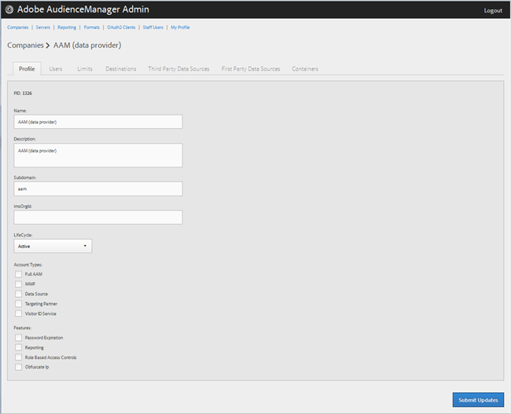

# Création d’un profil d’entreprise {#create-a-company-profile}

Utilisez la [!UICONTROL Companies] page de l’outil d’administration des Audiences Manager pour créer une société.

<!-- t_create_company.xml -->

>[!NOTE]
>
>Vous devez avoir le **[!UICONTROL DEXADMIN]** rôle pour créer de nouvelles sociétés.

1. Cliquez sur **[!UICONTROL Companies]** > **[!UICONTROL Add Company]**.
1. Renseignez les champs suivants :

   * **[!UICONTROL Name]**: (Obligatoire) Indiquez le nom de la société.
   * **[!UICONTROL Description]**: (Obligatoire) Fournissez des informations descriptives sur la société, comme l&#39;industrie ou son nom complet.
   * **[!UICONTROL Subdomain]**: (Obligatoire) Spécifiez le sous-domaine de la société. Le texte que vous saisissez correspond au sous-domaine de l’appel de événement. Ça ne peut pas être changé. Il doit s’agir d’une chaîne de caractères [!DNL URL]valides.

      Par exemple, si votre société a été nommée [!DNL AcmeCorp], le sous-domaine sera [!DNL acmecorp]défini.

      L’Audience Manager utilise le sous-domaine pour le [!UICONTROL Data Collection Server]([!UICONTROL DCS]). Dans l&#39;exemple précédent, si votre société [!DNL URL] est pleine [!UICONTROL DCS] serait [!DNL acmecorp.demdex.net].

   * **[!UICONTROL Lifecyle]**: Spécifiez l’étape souhaitée pour la société :
      * **[!UICONTROL Active]**: Indiquez que la société sera un client d’Audience Manager actif. Un [!UICONTROL Active] compte signifie un client payant, non seulement pour le conseil, mais pour l&#39;Audience Manager SKU.
      * **[!UICONTROL Demo]**: Indiquez que la société sera utilisée à des fins de démonstration uniquement. Les données du Rapports seront automatiquement masquées.
      * **[!UICONTROL Prospect]**: Indiquez que la société est un client d’Audience Manager potentiel, tel qu’une société à laquelle est attribuée une configuration gratuite [!DNL POC] ou un compte pour une démonstration commerciale.
      * **[!UICONTROL Test]**: Indiquez que la société sera utilisée à des fins de test interne uniquement.
   * **[!UICONTROL Account Types]**: Spécifiez le jeu complet de types de compte pour cette société. Aucun type de compte n&#39;est mutuellement exclusif avec aucun autre type.
      * **[!UICONTROL Full AAM]**: Indiquez que la société aura un compte d’Adobe Audience Manager complet et que les utilisateurs auront un accès à la connexion.
      * **[!UICONTROL MMP]**: Indiquez que la société a été activée pour utiliser les [!UICONTROL Master Marketing Profile] ([!UICONTROL MMP]) fonctionnalités. Le [!UICONTROL MMP] permet le partage des audiences sur l’Experience Cloud à l’aide d’un [!UICONTROL Experience Cloud ID] ([!DNL MCID]) attribué à chaque visiteur, puis utilisé par l’Audience Manager. Si vous sélectionnez ce type de compte, la [!UICONTROL Experience Cloud ID Service] sélection est également automatique.

         Pour plus d’informations, voir [Audiences Services - Maître Marketing Profil](https://marketing.adobe.com/resources/help/en_US/mcloud/audience_library.html).
   * **[!UICONTROL Data Source]**: Indiquez que la société est un fournisseur de données tiers dans l’Audience Manager.
   * **[!UICONTROL Targeting Partner]**: Indiquez que la société agit comme plateforme de ciblage pour les clients d’Audience Manager.
   * **[!UICONTROL Visitor ID Service]**: Indiquez que la société a été activée pour utiliser le [!UICONTROL Experience Cloud Visitor ID Service].

      Le [!UICONTROL Experience Cloud Visitor ID Service] fournit un ID de visiteur universel pour toutes les solutions Experience Cloud. For more information, see the [Experience Cloud Visitor ID Service user guide](https://marketing.adobe.com/resources/help/en_US/mcvid/mcvid-overview.html).

   * **[!UICONTROL Agency]**: Indiquez que la société aura un [!UICONTROL Agency] compte.

1. Cliquez sur **[!UICONTROL Create]**. Suivez les instructions de la section [Modifier un Profil](../companies/admin-manage-company-profiles.md#edit-company-profile)de Société.

   

## Modification d’un profil d’entreprise {#edit-company-profile}

Modifiez un profil de société, notamment son nom, sa description, son sous-domaine, son cycle de vie, etc.

<!-- t_edit_company_profile.xml -->

1. Cliquez sur **[!UICONTROL Companies]**, puis recherchez et cliquez sur la société souhaitée pour afficher sa [!UICONTROL Profile] page.

   Utilisez la [!UICONTROL Search] zone ou les commandes de pagination au bas de la liste pour trouver la société souhaitée. Vous pouvez trier chaque colonne par ordre croissant ou décroissant en cliquant sur l’en-tête de la colonne de votre choix.

   

1. Modifiez les champs selon les besoins : 

   * **[!UICONTROL Name]**: Modifiez le nom de la société. Il s’agit d’un champ obligatoire.
   * **[!UICONTROL Description]**: Modifiez la description de la société. Il s’agit d’un champ obligatoire.
   * **[!UICONTROL Subdomain]**: (Obligatoire) Spécifiez le sous-domaine de la société. Le texte que vous saisissez correspond au sous-domaine de l’appel de événement. Ça ne peut pas être changé. Il doit s’agir d’une chaîne de caractères [!DNL URL]valides.

      Par exemple, si votre société a été nommée [!DNL AcmeCorp], le sous-domaine sera [!DNL acmecorp]défini.

      L’Audience Manager utilise le sous-domaine pour le [!UICONTROL Data Collection Server] ([!UICONTROL DCS]). Dans l&#39;exemple précédent, si votre société [!DNL URL] est pleine [!UICONTROL DCS] serait [!DNL acmecorp.demdex.net].

   * **[!UICONTROL imsOrgld]**: ([!UICONTROL Identity Management System Organization ID]) Cet identifiant vous permet de connecter votre société à Adobe Experience Cloud.
   * **[!UICONTROL Lifecyle]**: Spécifiez l’étape souhaitée pour la société :
      * **[!UICONTROL Active]**: Indiquez que la société sera un client d’Audience Manager actif. Un compte Actif signifie un client payant, non seulement pour consulter, mais aussi pour l’Audience Manager SKU.
      * **[!UICONTROL Demo]**: Indiquez que la société sera utilisée à des fins de démonstration uniquement. Les données du Rapports seront automatiquement masquées.
      * **[!UICONTROL Prospect]**: Indiquez que la société est un client d’Audience Manager potentiel, tel qu’une société à laquelle est attribuée une configuration gratuite [!DNL POC] ou un compte pour une démonstration commerciale.
      * **[!UICONTROL Test]**: Indiquez que la société sera utilisée à des fins de test interne uniquement.
   * **[!UICONTROL Account Types]**: Spécifiez le jeu complet de types de compte pour cette société. Aucun type de compte n&#39;est mutuellement exclusif avec aucun autre type.
      * **[!UICONTROL Full AAM]**: Indiquez que la société aura un compte d’Adobe Audience Manager complet et que les utilisateurs auront un accès à la connexion.
      * **[!UICONTROL MMP]**: Indiquez que la société a été activée pour utiliser les fonctionnalités du Profil ([!UICONTROL MMP]) marketing Maître.

         Si vous sélectionnez ce type de compte, **[!UICONTROL Visitor ID Service]** est également automatiquement sélectionné.
Pour plus d’informations, voir [Audiences Services - Maître Marketing Profil](https://marketing.adobe.com/resources/help/en_US/mcloud/audience_library.html).
   * **[!UICONTROL Data Source]**: Indiquez que la société est un fournisseur de données tiers dans l’Audience Manager.
   * **[!UICONTROL Targeting Partner]**: Indiquez que la société agit comme plateforme de ciblage pour les clients d’Audience Manager.
   * **[!UICONTROL Visitor ID Service]**: Indiquez que la société a été activée pour utiliser le service d’identification des Visiteurs Experience Cloud.

      Le service d’identifiant visiteur Experience Cloud fournit un identifiant visiteur universel pour toutes les solutions Experience Cloud. For more information, see the [Experience Cloud Visitor ID Service user guide](https://microsite.omniture.com/t2/help/en_US/mcvid/mcvid_service.html).

   * **[!UICONTROL Agency]**: Indiquez que la société aura un compte d&#39;agence.
   * **[!UICONTROL Features]**: Sélectionnez les options souhaitées:
      * **[!UICONTROL Password Expiration]**: Définit tous les mots de passe utilisateur de cette société à expirer après 90 jours afin d’accroître la sécurité des Audiences Manager.
      * **[!UICONTROL Reporting]**: Active le rapports d&#39;Audience Manager pour cette société.
      * **[!UICONTROL Role Based Access Controls]**: Activez les contrôles d&#39;accès basés sur les rôles pour cette société. Les contrôles d&#39;accès basés sur les rôles vous permettent de créer des groupes d’utilisateurs avec des autorisations d’accès différentes. Les utilisateurs individuels de ces groupes peuvent alors accéder uniquement à des fonctions spécifiques de l’Audience Manager.

1. Cliquez sur **[!UICONTROL Submit Updates]**.

## Suppression d’un Profil de Société {#delete-company-profile}

Utilisez la [!UICONTROL Companies] page de l&#39;outil d&#39;Audience Manager [!UICONTROL Admin] pour supprimer une société existante.

<!-- t_delete_company.xml -->

>[!NOTE]
>
>Vous devez avoir le [!UICONTROL DEXADMIN] rôle pour supprimer les sociétés existantes.

1. Pour supprimer une société existante, cliquez sur **[!UICONTROL Companies]**.

   

1. Cliquez  dans la **[!UICONTROL Actions]** colonne de la société souhaitée.
1. Cliquez sur **[!UICONTROL OK]** pour confirmer la suppression.
