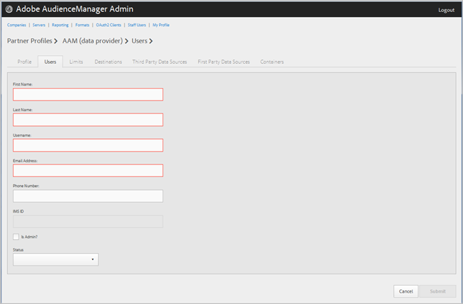

# Gestion des utilisateurs de l’entreprise {#manage-company-users}

Créez de nouveaux utilisateurs d’Audience Manager ou modifiez et supprimez des utilisateurs existants.

<!-- t_manage_company_users.xml -->

1. Cliquez sur **[!UICONTROL Companies]**, puis recherchez et cliquez sur la société souhaitée pour afficher sa [!UICONTROL Profile] page.

   Utilisez la [!UICONTROL Search] zone ou les commandes de pagination au bas de la liste pour trouver la société souhaitée. Vous pouvez trier chaque colonne par ordre croissant ou décroissant en cliquant sur l’en-tête de la colonne de votre choix.
1. Click the **[!UICONTROL Users]** tab.
1. Pour créer un utilisateur, cliquez sur **[!UICONTROL Create a New User]**. Pour modifier un utilisateur existant, recherchez et cliquez sur l’utilisateur concerné dans la **[!UICONTROL Username]** colonne.

   

1. Renseignez les champs suivants :

   * **[!UICONTROL First Name]**: (Obligatoire) Indiquez le prénom de l’utilisateur.
   * **[!UICONTROL Last Name]**: (Obligatoire) Indiquez le nom de famille de l’utilisateur.
   * **[!UICONTROL Username]**: (Obligatoire) Indiquez le nom d’utilisateur de l’Audience Manager de l’utilisateur. Les noms d’utilisateur doivent être uniques.
   * **[!UICONTROL Email Address]**: (Obligatoire) Indiquez l’adresse électronique de l’utilisateur.
   * **[!UICONTROL Phone Number]**: Indiquez le numéro de téléphone de l’utilisateur.
   * **[!UICONTROL IMS ID]**: L&#39;utilisateur est [!UICONTROL Identity Management System ID]. Cet identifiant permet à l’utilisateur d’établir un lien vers les solutions Adobe vers Adobe Experience Cloud.
   * **[!UICONTROL Is Admin]**: Faites de cet utilisateur un utilisateur administrateur d’Audience Manager. Un administrateur dispose de tous les rôles utilisateur d’Audience Manager pour ce partenaire.
   * **[!UICONTROL Status]**: Lors de la création d’un nouvel utilisateur, ce champ s’affiche initialement en tant que tel jusqu’à ce que l’utilisateur se connecte et réinitialise le mot de passe temporaire. **[!UICONTROL Pending]** Si vous modifiez un utilisateur existant, vous pouvez effectuer une sélection parmi les états suivants :
      * **[!UICONTROL Active]**: Indique que cet utilisateur est un utilisateur d’Audience Manager actif.
      * **[!UICONTROL Deactivated]**: Indique que cet utilisateur est un utilisateur d’Audience Manager désactivé.
      * **[!UICONTROL Expired]**: Indique que cet utilisateur est un utilisateur arrivé à expiration.
      * **[!UICONTROL Locked Out]**: Indique que cet utilisateur est un utilisateur verrouillé.

1. Cliquez sur **[!UICONTROL Submit]**.

## Supprimer un utilisateur {#delete-user}

Pour supprimer un utilisateur :

1. Cliquez sur **[!UICONTROL Companies]**, recherchez et cliquez sur la société de votre choix, puis sur l’ **[!UICONTROL Users]** onglet.
1. Cliquez  dans la **[!UICONTROL Actions]** colonne de l’utilisateur de votre choix.
1. Cliquez sur **[!UICONTROL OK]** pour confirmer la suppression.