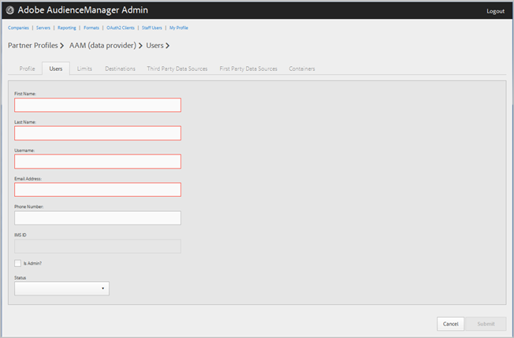

# Gestion des utilisateurs de l’entreprise {#manage-company-users}

Créez de nouveaux utilisateurs d’Audience Manager ou modifiez et supprimez des utilisateurs existants.

<!-- t_manage_company_users.xml -->

1. Cliquez sur **[!UICONTROL Companies]**, puis localisez et cliquez sur la société souhaitée pour afficher sa page [!UICONTROL Profile].

   Utilisez la zone [!UICONTROL Search] ou les commandes de pagination au bas de la liste pour trouver la société souhaitée. Vous pouvez trier chaque colonne par ordre croissant ou décroissant en cliquant sur l’en-tête de la colonne de votre choix.
1. Cliquez sur l’onglet **[!UICONTROL Users]** .
1. Pour créer un utilisateur, cliquez sur **[!UICONTROL Create a New User]**. Pour modifier un utilisateur existant, recherchez et cliquez sur l’utilisateur de votre choix dans la colonne **[!UICONTROL Username]**.

   

1. Renseignez les champs suivants :

   * **[!UICONTROL First Name]** : (obligatoire) prénom de l’utilisateur.
   * **[!UICONTROL Last Name]** : (obligatoire) nom de l’utilisateur.
   * **[!UICONTROL Username]** : (obligatoire) indiquez le nom d’Audience Manager de l’utilisateur. Les noms d’utilisateur doivent être uniques.
   * **[!UICONTROL Email Address]** : (obligatoire) adresse électronique de l’utilisateur.
   * **[!UICONTROL Phone Number]** : indiquez le numéro de téléphone de l’utilisateur.
   * **[!UICONTROL IMS ID]** : [!UICONTROL Identity Management System ID] de l’utilisateur. Cet identifiant permet à l’utilisateur d’Adobe des solutions à Adobe Experience Cloud.
   * **[!UICONTROL Is Admin]** : Faites de cet utilisateur un utilisateur administrateur d’Audience Manager. Un administrateur dispose de tous les rôles utilisateur d’Audience Manager pour ce partenaire.
   * **[!UICONTROL Status]** : lors de la création d’un utilisateur, ce champ s’affiche initialement sous la forme **[!UICONTROL Pending]** jusqu’à ce que l’utilisateur se connecte et réinitialise le mot de passe temporaire. Si vous modifiez un utilisateur existant, vous pouvez effectuer une sélection parmi les états suivants :
      * **[!UICONTROL Active]** : indique que cet utilisateur est un utilisateur d’Audience Manager actif.
      * **[!UICONTROL Deactivated]** : indique que cet utilisateur est un utilisateur d’Audience Manager désactivé.
      * **[!UICONTROL Expired]** : indique que cet utilisateur a expiré.
      * **[!UICONTROL Locked Out]** : indique que cet utilisateur est un utilisateur verrouillé.

1. Cliquez sur **[!UICONTROL Submit]**.

## Supprimer un utilisateur {#delete-user}

Pour supprimer un utilisateur :

1. Cliquez sur **[!UICONTROL Companies]**, recherchez et cliquez sur la société souhaitée, puis cliquez sur l’onglet **[!UICONTROL Users]** .
1. Cliquez sur  dans la colonne **[!UICONTROL Actions]** de l’utilisateur souhaité.
1. Cliquez sur **[!UICONTROL OK]** pour confirmer la suppression.
