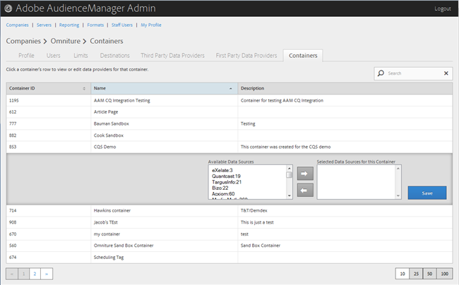

# Gestion des conteneurs {#manage-containers}

Afficher ou modifier les fournisseurs de données pour les conteneurs.

<!-- t_containers.xml -->

>[!NOTE]
>
>Par défaut, les entreprises sont créées avec un conteneur unique. Vous pouvez créer d’autres conteneurs pour une entreprise dans l’interface utilisateur, dans **[!UICONTROL Manage Data > Tags]**.

1. Cliquez sur **[!UICONTROL Companies]**, puis recherchez et cliquez sur l’entreprise souhaitée pour afficher sa [!UICONTROL Profile] page.

   Utilisez la [!UICONTROL Search] zone ou les commandes de pagination au bas de la liste pour trouver la société souhaitée. Vous pouvez trier chaque colonne par ordre croissant ou décroissant en cliquant sur l’en-tête de la colonne de votre choix.

1. Click the **[!UICONTROL Containers]** tab.

   

1. Cliquez sur la ligne d’un conteneur pour afficher ou modifier les fournisseurs de données de ce conteneur.

   

1. Déplacez les sources de données des listes **[!UICONTROL Available Data Sources]** et **[!UICONTROL Selected Data Sources for This Container]** des listes en sélectionnant les sources de données de votre choix, puis en cliquant sur les flèches vers la droite ou vers la gauche si nécessaire.

   Vous pouvez également effectuer cette tâche à partir de la page [Fournisseur de données](../companies/admin-third-party-providers.md#task_E942DD674D794BA6B8EFD52FD866E689)tiers.

1. Cliquez sur **[!UICONTROL Save]** si vous avez apporté des modifications.

>[!MORE_LIKE_This]
>
>* [Synchronisation des identifiants avec Media Optimizer](../companies/admin-amo-sync.md#concept_2B5537233DAA4860B3503B344F937D83)

