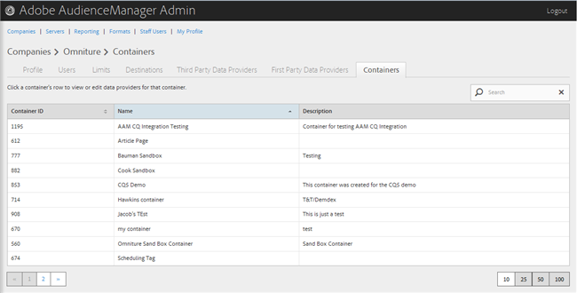

# Gestion des conteneurs {#manage-containers}

Affichage ou modification des fournisseurs de données pour les conteneurs.

<!-- t_containers.xml -->

>[!NOTE]
>
>Par défaut, les entreprises sont créées avec un seul conteneur. Vous pouvez créer d’autres conteneurs pour une société dans l’interface utilisateur, dans **[!UICONTROL Tools > Tags]**.

1. Cliquez sur **[!UICONTROL Companies]**, puis localisez et cliquez sur la société de votre choix pour afficher sa page [!UICONTROL Profile].

   Utilisez la zone [!UICONTROL Search] ou les commandes de pagination en bas de la liste pour trouver la société souhaitée. Vous pouvez trier chaque colonne par ordre croissant ou décroissant en cliquant sur l’en-tête de la colonne de votre choix.

1. Cliquez sur l’onglet **[!UICONTROL Containers]** .

   

1. Cliquez sur la ligne d’un conteneur pour afficher ou modifier les fournisseurs de données pour ce conteneur.

   

1. Déplacez les sources de données des listes **[!UICONTROL Available Data Sources]** et **[!UICONTROL Selected Data Sources for This Container]** en sélectionnant les sources de données de votre choix, puis en cliquant sur les flèches droite ou gauche si nécessaire.

   Vous pouvez également effectuer cette tâche à partir de la page [Fournisseurs de données tiers](../companies/admin-third-party-providers.md#task_E942DD674D794BA6B8EFD52FD866E689).

1. Cliquez sur **[!UICONTROL Save]** si vous avez apporté des modifications.

>[!MORELIKETHIS]
>
>* [Synchronisation des identifiants avec Media Optimizer](../companies/admin-amo-sync.md#concept_2B5537233DAA4860B3503B344F937D83)

