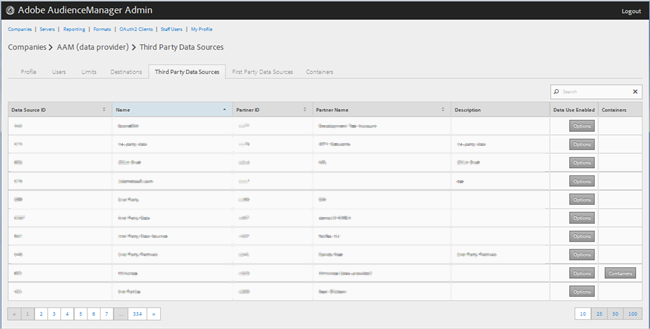
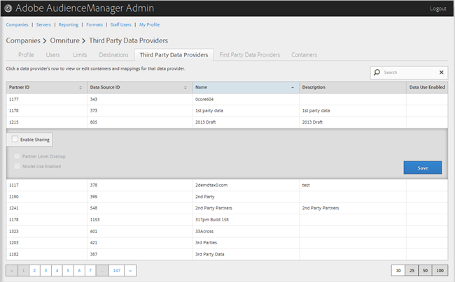

# Gestion des fournisseurs de données tiers {#manage-third-party-data-providers}

Affichez ou modifiez des conteneurs et des mappages pour les fournisseurs de données tiers. Vous pouvez également activer le partage avec différents fournisseurs de données.

1. Cliquez sur **[!UICONTROL Companies]**, puis localisez et cliquez sur la société de votre choix pour afficher sa page [!UICONTROL Profile].

   Utilisez la zone [!UICONTROL Search] ou les commandes de pagination en bas de la liste pour trouver la société souhaitée. Vous pouvez trier chaque colonne par ordre croissant ou décroissant en cliquant sur l’en-tête de la colonne de votre choix.
1. Cliquez sur l’onglet **[!UICONTROL Third Party Data Providers]** .

   

1. Cliquez sur la ligne d’un fournisseur de données pour afficher ou modifier des conteneurs et des mappages pour ce fournisseur de données.

   

1. Sélectionnez **[!UICONTROL Enable Sharing]** pour activer les options suivantes :

   * **Chevauchement au niveau du partenaire :**
   * **Utilisation du modèle activée :** permet à cette entreprise d’utiliser ce fournisseur de données lors de la création de modèles algorithmiques.

   Lorsque vous activez le partage, vous avez accès aux caractéristiques de ce fournisseur de données.

1. (Conditionnel) Si le conteneur est activé pour ce fournisseur, vous pouvez sélectionner des conteneurs pour ce fournisseur de données en déplaçant les conteneurs de votre choix de la liste disponible vers la liste sélectionnée.

   Vous pouvez également effectuer cette tâche à partir de la page [Conteneurs](../companies/admin-manage-containers.md#task_61DB5CEECC5049DD8D059C642AC3F967) .
1. Cliquez sur **[!UICONTROL Save]** si vous avez apporté des modifications.
