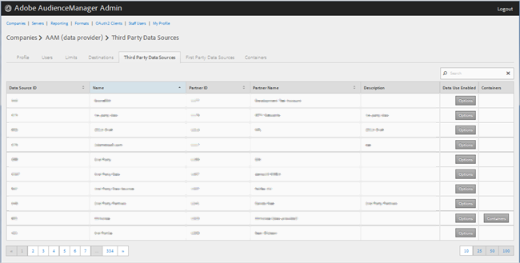
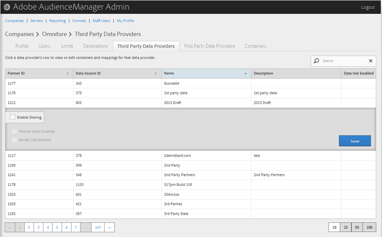

# Gestion Des Fournisseurs De Données Tiers {#manage-third-party-data-providers}

Affichez ou modifiez les conteneurs et les mappages pour les fournisseurs de données tiers. Vous pouvez également activer le partage avec différents fournisseurs de données.

1. Cliquez sur **[!UICONTROL Companies]**, puis recherchez et cliquez sur la société souhaitée pour afficher sa page [!UICONTROL Profile].

   Utilisez la boîte de [!UICONTROL Search] ou les commandes de pagination au bas de la liste pour trouver l’entreprise souhaitée. Vous pouvez trier chaque colonne par ordre croissant ou décroissant en cliquant sur l’en-tête de la colonne souhaitée.
1. Cliquez sur l’onglet **[!UICONTROL Third Party Data Providers]** .

   

1. Cliquez sur la ligne d’un fournisseur de données pour afficher ou modifier les conteneurs et les mappages de ce fournisseur de données.

   

1. Sélectionnez **[!UICONTROL Enable Sharing]** pour activer les options suivantes :

   * **Chevauchement au niveau des partenaires :**
   * **Utilisation du modèle activée :** permet à cette entreprise d’utiliser ce fournisseur de données lors de la création de modèles algorithmiques.

   Lorsque vous activez le partage, vous avez accès aux caractéristiques de ce fournisseur de données.

1. (Conditionnel) Si le conteneur est activé pour ce fournisseur, vous pouvez sélectionner des conteneurs pour ce fournisseur de données en déplaçant les conteneurs souhaités de la liste disponible vers la liste sélectionnée.

   Vous pouvez également effectuer cette tâche à partir de la page [Conteneurs](../companies/admin-manage-containers.md#task_61DB5CEECC5049DD8D059C642AC3F967).
1. Cliquez sur **[!UICONTROL Save]** si vous avez apporté des modifications.
