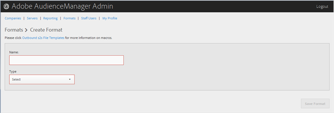

# Création ou modification d’un format {#create-or-edit-a-format}

Utilisez la page [!UICONTROL Formats] de l’outil d’administration des Audiences Manager pour créer un nouveau format ou modifier un format existant.

<!-- t_create_format.xml -->

>[!TIP]
>
>Lors de la sélection d’un format pour vos données délimitées, il est préférable, si possible, de réutiliser un format existant. L’utilisation d’un format déjà éprouvé garantit que vos données sortantes seront générées avec succès. Pour voir exactement comment est formaté un format existant, cliquez sur l&#39;option [!UICONTROL Formats] dans la barre de menus et recherchez votre format par nom ou par numéro d&#39;identification. Les formats incorrects ou les macros utilisés dans les formats fournissent une sortie mal formatée ou empêchent la sortie complète des informations.

1. Pour créer un nouveau format, cliquez sur **[!UICONTROL Formats]** > **[!UICONTROL Add Format]**. Pour éditer un format existant, cliquez sur le format souhaité dans la colonne **[!UICONTROL Name]**.

   

1. Renseignez les champs suivants :
   * **Nom :**  (obligatoire) attribuez un nom explicite au format.
   * **Type :** (obligatoire) sélectionnez le format souhaité :
      * **[!UICONTROL File]**: Envoie les données par le biais de  [!DNL FTP] fichiers.
      * **[!UICONTROL HTTP]**: Enferme les données dans un  [!DNL JSON] wrapper.

1. (Conditionnel) Si vous choisissez **[!UICONTROL File]**, renseignez les champs suivants :

   >[!NOTE]
   >
   >Pour obtenir la liste des macros disponibles, voir [Macros au format de fichier](../formats/file-formats.md#concept_A867101505074418A58DE325949E5089) et [Macros au format HTTP](../formats/web-formats.md#reference_C392124A5F3F42E49F8AADDBA601ADFE).

   * **[!UICONTROL File Name]:** indiquez le nom de fichier du fichier de transfert de données.
   * **En-tête :** spécifiez le texte qui apparaît dans la première ligne du fichier de transfert de données.
   * **[!UICONTROL Data Row]:** spécifiez le texte qui apparaît dans chaque ligne délimitée du fichier.
   * **[!UICONTROL Maximum File Size (In MB)]:** spécifiez la taille maximale des fichiers de transfert de données. Les fichiers compressés doivent être inférieurs à 100 Mo. La taille de fichier non compressé n’est pas limitée.
   * **[!UICONTROL Compression]:**  sélectionnez le type de compression souhaité : gz ou zip pour vos fichiers de données. Pour une diffusion vers [!UICONTROL AWS S3], vous devez utiliser des fichiers .gz ou non compressés.
   * **[!UICONTROL .info Receipt]:** indique qu’un fichier de contrôle de transfert ([!DNL .info]) est généré. Le fichier [!DNL .info] fournit des informations de métadonnées sur les transferts de fichiers afin que les partenaires puissent vérifier que l’Audience Manager a géré correctement les transferts de fichiers. Pour plus d’informations, voir [Fichiers de contrôle de transfert pour les transferts de fichiers journaux](https://experienceleague.adobe.com/docs/audience-manager/user-guide/implementation-integration-guides/receiving-audience-data/batch-outbound-data-transfers/transfer-control-files.html?lang=en).
   * **[!UICONTROL MD5 Checksum Receipt]:** indique qu’un reçu de  [!DNL MD5] somme de contrôle est généré. Le ticket de caisse [!DNL MD5] afin que les partenaires puissent vérifier que l’Audience Manager a géré correctement le transfert complet.

1. (Conditionnel) Si vous choisissez **[!UICONTROL HTTP]**, renseignez les champs suivants :

   * **[!UICONTROL Method]:** choisissez la  [!DNL API] méthode à utiliser pour votre processus de transfert :
      * **[!UICONTROL POST]:** Si vous sélectionnez  [!DNL POST], sélectionnez le type de contenu ([!DNL XML] ou  [!DNL JSON]), puis spécifiez le corps de la requête.
      * **[!UICONTROL GET]:** Si vous sélectionnez  [!DNL GET], spécifiez les paramètres de requête.

1. Cliquez sur **[!UICONTROL Create]** si vous créez un nouveau format ou sur **[!UICONTROL Save Updates]** si vous modifiez un format existant.

## Suppression d’un format {#delete-format}

1. Cliquez sur **[!UICONTROL Formats]**.
2. Cliquez sur  dans la colonne **[!UICONTROL Actions]** du format souhaité.
3. Cliquez sur **[!UICONTROL OK]** pour confirmer la suppression.
