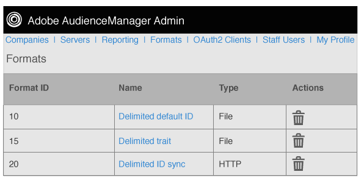

# Présentation des formats {#formats-overview}

Un format est un modèle (ou fichier) enregistré qui utilise des macros pour organiser le contenu des données envoyées vers une destination. Les types de format incluent les formats [!DNL HTTP] et les formats de fichier. [!DNL HTTP] Les formats envoient des données dans un  [!DNL JSON] objet avec une méthode  [!DNL POST] ou  [!DNL GET] . Les formats de fichier envoient des données dans un fichier par [!DNL FTP]. Les macros utilisées par chaque format permettent de définir les noms de fichier, de définir des en-têtes de fichier et d’organiser le contenu d’un fichier de données. Dans l’ [!DNL UI] administrateur, vous pouvez créer, enregistrer et réutiliser des formats lors de la configuration de destinations pour les clients.

