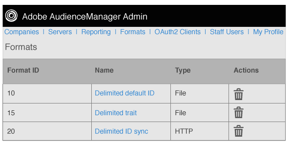

# Présentation des formats {#formats-overview}

Un format est un modèle (ou fichier) enregistré qui utilise des macros pour organiser le contenu des données envoyées à une destination. Les types de format incluent les formats [!DNL HTTP] et les formats de fichier. Les formats de [!DNL HTTP] envoient des données dans un objet [!DNL JSON] avec une méthode [!DNL POST] ou [!DNL GET]. Les formats de fichier envoient les données dans un fichier par [!DNL FTP]. Les macros utilisées par chaque format vous permettent de définir des noms de fichier, des en-têtes de fichier et d’organiser le contenu d’un fichier de données. Dans Admin [!DNL UI], vous pouvez créer, enregistrer et réutiliser des formats lors de la configuration de destinations pour les clients et les clientes.

